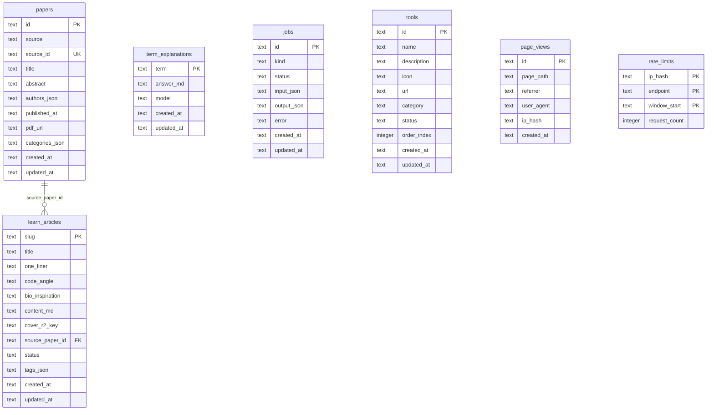

# Architecture Diagrams

Comprehensive architecture documentation for neural-coding.com using Mermaid diagrams.

## System Architecture (C4 Context)

High-level view of the system and its external dependencies.

## Container Diagram

Shows the major containers/services in the system.

## Data Flow Diagram

Shows how data flows through the system during key operations.

## Sequence Diagram: Article Retrieval

Shows the flow when a user requests an article.

## Sequence Diagram: Paper Ingestion

Shows the automated paper ingestion flow.

## Deployment Architecture

Shows the deployment topology.

## Database Schema (ERD)

Entity-Relationship Diagram for the D1 database.

## API Routes Flowchart

Shows the API routing structure.

## Component Interaction

Shows how frontend components interact with the API.

## Rate Limiting Flow

Shows how rate limiting is implemented.

## Caching Strategy

Shows the multi-layer caching approach.

## Error Handling Flow

Shows how errors are handled throughout the system.

---

## Legend

| Symbol | Meaning |
|--------|---------|
| Rectangle | Process/Service |
| Cylinder | Database/Storage |
| Diamond | Decision |
| Circle | Start/End |
| Parallelogram | Input/Output |

## Tools for Viewing

These diagrams use [Mermaid](https://mermaid.js.org/) syntax. View them in:

- GitHub (native support)
- VS Code with Mermaid extension
- [Mermaid Live Editor](https://mermaid.live/)
- Any Markdown viewer with Mermaid support
