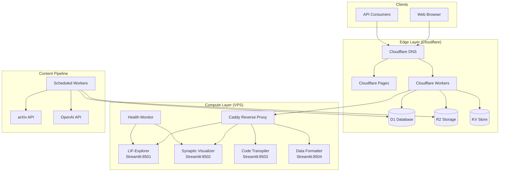
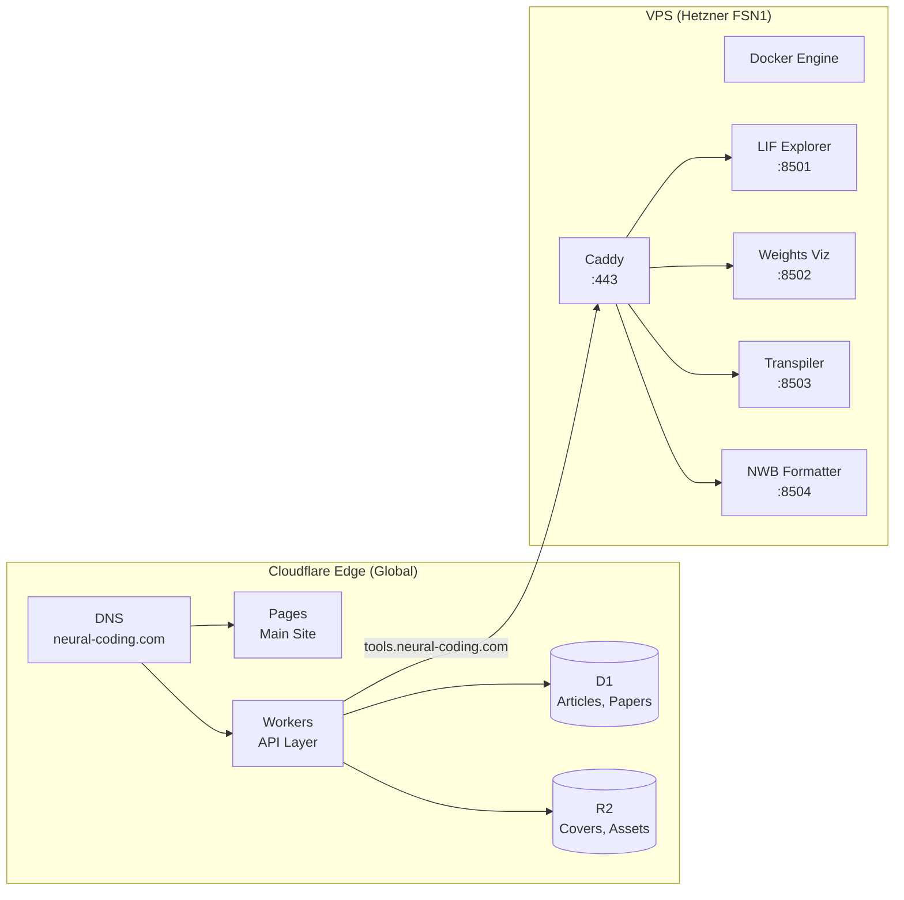
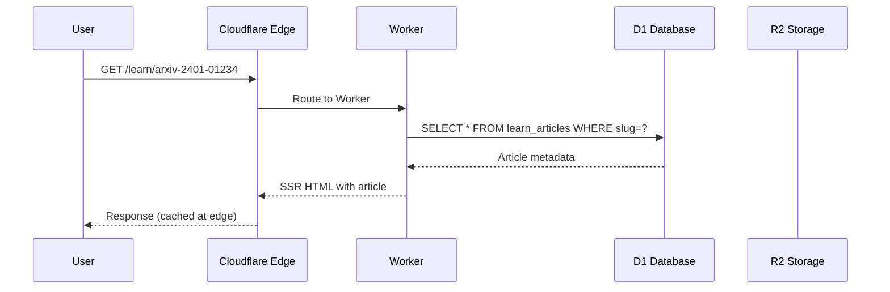
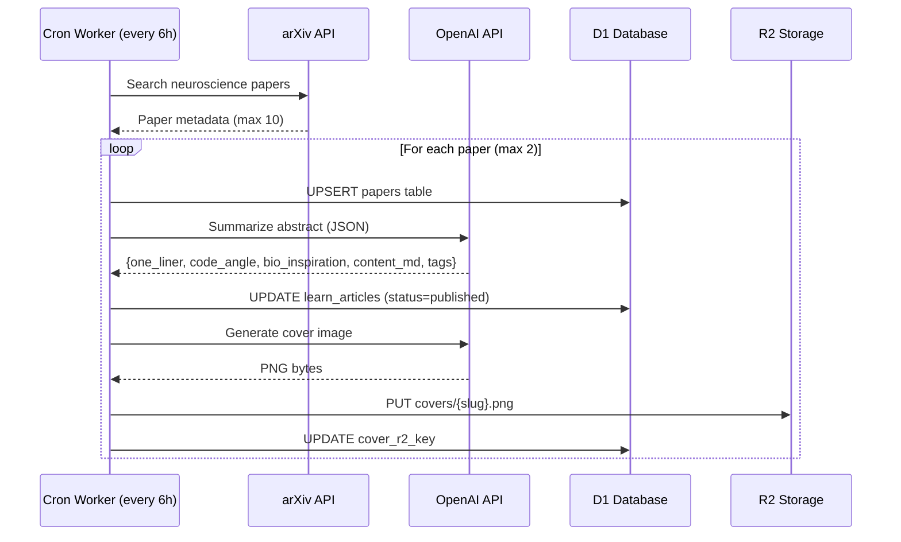
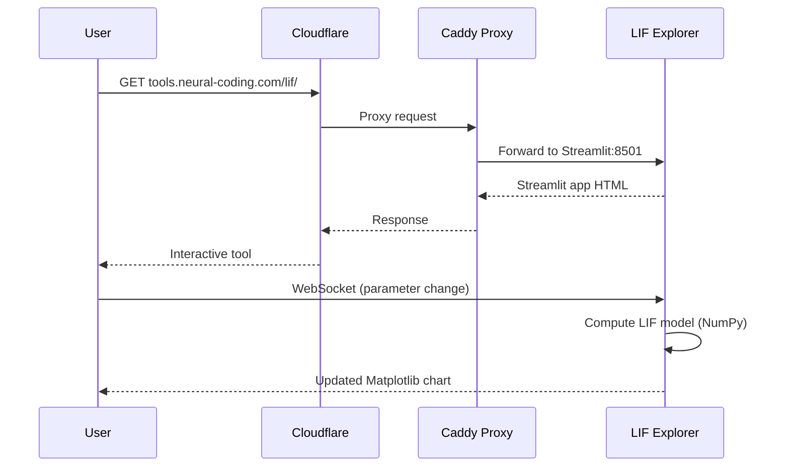
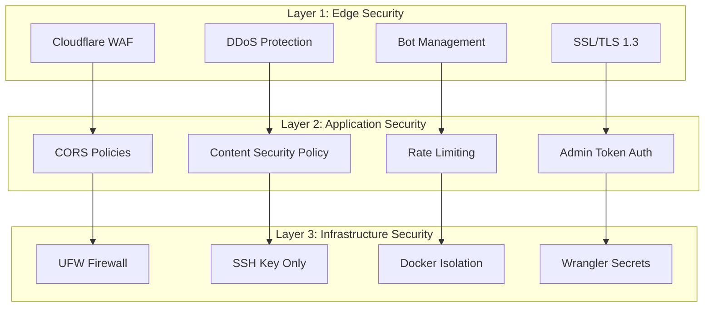
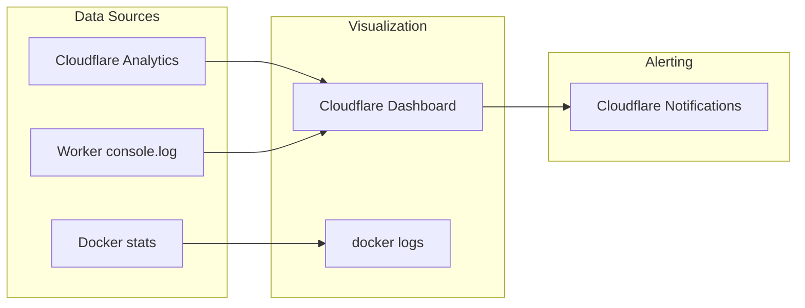

# Neural-Coding.com System Blueprint

## Executive Summary

Neural-coding.com is a computational neuroscience education platform combining interactive tools, AI-generated content, and modern edge infrastructure. This blueprint defines the complete system architecture for production deployment.

---

## System Architecture



---

## Tech Stack

### Frontend

| Technology | Version | Purpose |
|------------|---------|---------|
| Astro | 5.17.x | Static site generator |
| TypeScript | 5.9.x | Type safety |
| Tailwind CSS | 3.4.x | Styling |
| Shiki | - | Code syntax highlighting |
| @astrojs/sitemap | 3.7.x | SEO sitemap generation |

### Backend (Workers)

| Technology | Version | Purpose |
|------------|---------|---------|
| Cloudflare Workers | - | Edge compute, API |
| Hono | 4.x | Worker framework |
| Zod | 3.x | Request validation |
| TypeScript | 5.9.x | Type safety |

### Tools (Streamlit)

| Technology | Version | Purpose |
|------------|---------|---------|
| Streamlit | 1.38.x | Interactive tools |
| Python | 3.12.x | Tool backends |
| NumPy | 1.26.x | Numerical computing |
| Matplotlib | 3.9.x | Visualization |

### Infrastructure

| Service | Tier | Limits |
|---------|------|--------|
| Cloudflare Pages | Free | Unlimited sites, 500 builds/mo |
| Cloudflare Workers | Free | 100k requests/day |
| Cloudflare D1 | Free | 5GB storage, 5M rows |
| Cloudflare R2 | Free | 10GB storage |
| Cloudflare KV | Free | 100k reads/day |
| VPS (Hetzner CX22) | 4.51 EUR/mo | 2 vCPU, 4GB RAM |

### External APIs

| API | Tier | Rate Limit | Purpose |
|-----|------|------------|---------|
| OpenAI API | Pay-per-use | 60 RPM | Content generation |
| arXiv API | Free | 1 req/3s | Paper metadata |
| OpenReview API | Free | - | Conference papers |

---

## Infrastructure Topology



### Network Configuration

| Endpoint | Protocol | Port | Target |
|----------|----------|------|--------|
| neural-coding.com | HTTPS | 443 | Cloudflare Pages |
| neural-coding.com/api/* | HTTPS | 443 | Cloudflare Workers |
| neural-coding.com/learn/* | HTTPS | 443 | Cloudflare Workers (SSR) |
| neural-coding.com/assets/* | HTTPS | 443 | Cloudflare Workers (R2) |
| tools.neural-coding.com | HTTPS | 443 | VPS Caddy |

### VPS Specifications (Hetzner CX22)

- **CPU**: 2 vCPU (AMD EPYC)
- **RAM**: 4 GB
- **Storage**: 40 GB NVMe
- **Bandwidth**: 20 TB/month
- **Location**: Falkenstein, Germany
- **IPv4**: Static
- **Cost**: 4.51 EUR/month

---

## Data Flow Diagrams

### User Request Flow



### Content Generation Flow



### Tool Interaction Flow



---

## Security Architecture

### Defense Layers



### Security Controls

| Control | Implementation | Location |
|---------|----------------|----------|
| DDoS Protection | Cloudflare automatic | Edge |
| WAF Rules | OWASP Core Ruleset | Edge |
| SSL/TLS | TLS 1.3, HSTS | Edge |
| Rate Limiting | D1 cache + per-IP | Workers |
| CORS | Strict origin policy | Workers |
| CSP | Strict policy | Headers |
| Admin Auth | Bearer token (ADMIN_TOKEN) | Workers |
| SSH Access | Key-only, no root | VPS |
| Firewall | UFW allow 80,443,22 | VPS |
| Secrets | wrangler secret put | Workers |

### Security Headers

```typescript
const securityHeaders = {
  'Content-Security-Policy': [
    "default-src 'self'",
    "script-src 'self' 'unsafe-inline'",
    "style-src 'self' 'unsafe-inline'",
    "img-src 'self' data: https://*.neural-coding.com",
    "connect-src 'self' https://api.neural-coding.com",
    "frame-ancestors 'none'",
    "base-uri 'self'",
    "form-action 'self'"
  ].join('; '),
  'X-Content-Type-Options': 'nosniff',
  'X-Frame-Options': 'DENY',
  'X-XSS-Protection': '1; mode=block',
  'Referrer-Policy': 'strict-origin-when-cross-origin',
  'Permissions-Policy': 'geolocation=(), microphone=(), camera=()',
  'Strict-Transport-Security': 'max-age=31536000; includeSubDomains; preload'
};
```

---

## Cost Estimates

### Monthly Operating Costs

| Service | Tier | Monthly Cost | Notes |
|---------|------|--------------|-------|
| Cloudflare Pages | Free | $0 | Unlimited sites |
| Cloudflare Workers | Free | $0 | 100k requests/day |
| Cloudflare D1 | Free | $0 | 5GB storage |
| Cloudflare R2 | Free | $0 | 10GB storage |
| Hetzner VPS CX22 | Paid | $4.85 | 4GB RAM, 2 vCPU |
| Domain (neural-coding.com) | Annual | $1.00 | ~$12/year |
| OpenAI API | Pay-per-use | $15-30 | ~60 articles/month |
| **Total** | | **$20-35/mo** | |

### Scaling Cost Projections

| Traffic Level | Workers | D1 | R2 | VPS | OpenAI | Total |
|---------------|---------|----|----|-----|--------|-------|
| 10k visits/mo | Free | Free | Free | $4.85 | $15 | ~$20 |
| 50k visits/mo | Free | Free | Free | $4.85 | $25 | ~$30 |
| 100k visits/mo | $5 | Free | Free | $8.50 | $30 | ~$45 |
| 500k visits/mo | $15 | $5 | $5 | $15 | $50 | ~$90 |

### Cost Optimization Strategies

1. **Aggressive Caching**: Cache articles at edge (stale-while-revalidate)
2. **Image Optimization**: WebP format, lazy loading, R2 immutable cache
3. **Rate Limiting**: Hard caps on brain-context API calls
4. **Batch Processing**: Generate max 2 articles per cron tick
5. **D1 Caching**: Cache term explanations to avoid repeated OpenAI calls

---

## Monitoring & Observability

### Metrics Collection



### Key Metrics

| Metric | Source | Alert Threshold |
|--------|--------|-----------------|
| Request latency (p99) | Workers | > 500ms |
| Error rate (5xx) | Workers | > 1% |
| D1 query time | D1 | > 100ms |
| VPS CPU usage | docker stats | > 80% |
| VPS memory usage | docker stats | > 85% |
| Streamlit response time | Health check | > 3s |
| Content generation failures | jobs table | > 3/day |

### Health Check Endpoints

```typescript
// Worker health check
app.get("/api/health", (c) => c.json({ ok: true, ts: nowIso() }));
app.get("/api/v1/health", (c) => c.json({ ok: true, ts: nowIso() }));
```

```bash
# VPS health check
curl -f https://tools.neural-coding.com/lif/ || exit 1
```

---

## Disaster Recovery

### Backup Strategy

| Data | Frequency | Retention | Location |
|------|-----------|-----------|----------|
| D1 Database | Daily | 30 days | R2 bucket |
| R2 Content | Real-time | Indefinite | Multi-region |
| VPS Config | On change | Git history | GitHub |
| Docker volumes | Weekly | 4 weeks | R2 bucket |

### Recovery Procedures

1. **D1 Corruption**: Restore from R2 backup (RTO: 15 min)
2. **VPS Failure**: Redeploy from Docker Compose (RTO: 30 min)
3. **Cloudflare Outage**: Wait for resolution (no self-hosted fallback)
4. **Content Loss**: Re-run ingestion pipeline from arXiv

### Backup Script

```bash
#!/bin/bash
# backup-d1.sh - Daily backup to R2
DATE=$(date +%Y%m%d)

wrangler d1 export neural_coding_prod --output=/tmp/d1-backup-$DATE.sql
gzip /tmp/d1-backup-$DATE.sql
wrangler r2 object put neural-coding-assets/backups/d1-backup-$DATE.sql.gz \
  --file=/tmp/d1-backup-$DATE.sql.gz

echo "Backup completed: d1-backup-$DATE.sql.gz"
```

---

## Architecture Decision Records

### ADR-001: Cloudflare Stack

**Decision**: Use Cloudflare (Pages + Workers + D1 + R2) as primary infrastructure
**Rationale**:
- Free tier covers MVP needs (100k requests/day)
- Simpler deployment than AWS (no IAM complexity)
- Built-in DDoS protection and global CDN
- D1 provides SQLite-compatible relational database

### ADR-002: Caddy over Nginx

**Decision**: Use Caddy for VPS reverse proxy
**Rationale**:
- Automatic HTTPS with Let's Encrypt
- Minimal configuration (5 lines vs 50+ for Nginx)
- Built-in HTTP/2 and HTTP/3 support
- Lower memory footprint

### ADR-003: Streamlit for Tools

**Decision**: Use Streamlit for interactive neuroscience tools
**Rationale**:
- Fastest path to working demos (Python-native)
- Built-in state management and widgets
- Easy deployment with Docker
- NumPy/Matplotlib ecosystem for scientific computing

### ADR-004: OpenAI for Content Generation

**Decision**: Use OpenAI API (gpt-4o-mini + gpt-image-1) for content
**Rationale**:
- Structured JSON output for article generation
- Image generation for cover art
- Cost-effective with gpt-4o-mini (~$0.15/1M input tokens)
- Can switch to Claude API if needed (same interface pattern)

### ADR-005: Same-Domain Routing

**Decision**: Use path-based routing on neural-coding.com instead of subdomains
**Rationale**:
- Simpler SSL certificate management
- Better SEO (single domain authority)
- Cloudflare Workers routes handle path splitting
- Exception: tools.neural-coding.com for Streamlit (WebSocket compatibility)

---

## Implementation Checklist

### Phase 1: Foundation (Week 1)

- [ ] Configure Cloudflare DNS for neural-coding.com
- [ ] Create D1 database: `neural_coding_prod`
- [ ] Create R2 bucket: `neural-coding-assets`
- [ ] Deploy initial Pages site (Astro)
- [ ] Deploy Worker API (Hono)
- [ ] Provision Hetzner VPS CX22
- [ ] Install Docker + Caddy on VPS
- [ ] Deploy LIF-Explorer container

### Phase 2: Content (Week 2)

- [ ] Create landing page with tool links
- [ ] Initialize D1 schema (papers, learn_articles, term_explanations, jobs)
- [ ] Implement /learn SSR routes
- [ ] Implement /api/v1/learn/posts endpoints
- [ ] Set up OPENAI_API_KEY secret
- [ ] Test manual article creation

### Phase 3: Automation (Week 3-4)

- [ ] Enable cron trigger (every 6 hours)
- [ ] Test arXiv ingestion pipeline
- [ ] Test OpenAI summarization
- [ ] Test cover image generation
- [ ] Monitor jobs table for failures
- [ ] Add remaining Streamlit tools

### Phase 4: Optimization (Month 2)

- [ ] Performance audit (Lighthouse)
- [ ] SEO implementation (JSON-LD, OpenGraph)
- [ ] Cost optimization review
- [ ] Security audit
- [ ] User feedback collection
