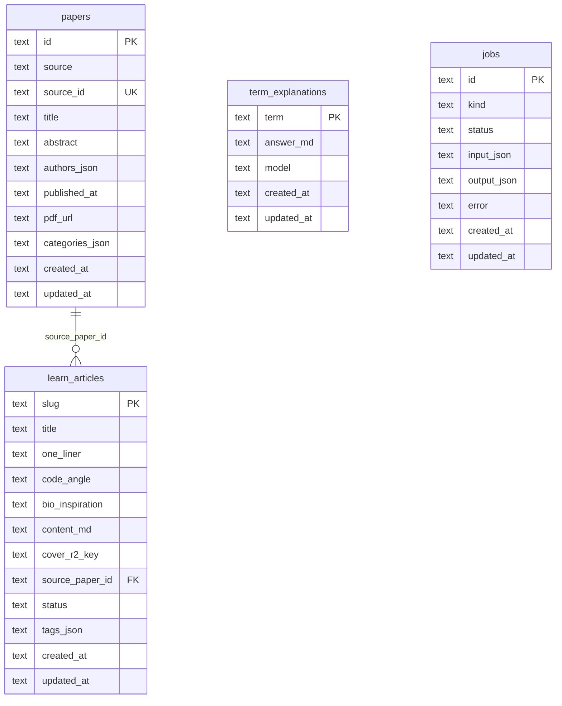

# Neural-Coding.com Database Schema

## Overview

This document provides complete database schema documentation for neural-coding.com, including table definitions, indexes, migrations, sample queries, and data retention policies.

**Database**: Cloudflare D1 (SQLite-compatible)

---

## Schema Diagram



---

## Table Definitions

### papers

Stores raw paper metadata from arXiv and OpenReview.

```sql
CREATE TABLE IF NOT EXISTS papers (
    -- Primary key: {source}_{source_id}
    id TEXT PRIMARY KEY,

    -- Source identifier
    source TEXT NOT NULL,           -- 'arxiv' | 'openreview'
    source_id TEXT NOT NULL,        -- e.g., '2401.01234' or 'abc123'

    -- Paper metadata
    title TEXT NOT NULL,
    abstract TEXT NOT NULL,
    authors_json TEXT NOT NULL,     -- JSON array: ["Author 1", "Author 2"]
    published_at TEXT NOT NULL,     -- ISO 8601: "2026-01-15T00:00:00Z"
    pdf_url TEXT,                   -- Direct PDF link (nullable)
    categories_json TEXT NOT NULL,  -- JSON array: ["q-bio.NC", "cs.NE"]

    -- Timestamps
    created_at TEXT NOT NULL,       -- ISO 8601
    updated_at TEXT NOT NULL,       -- ISO 8601

    -- Constraints
    UNIQUE(source, source_id)
);

-- Indexes
CREATE INDEX IF NOT EXISTS idx_papers_source ON papers(source);
CREATE INDEX IF NOT EXISTS idx_papers_published ON papers(published_at DESC);
```

**Column Details**

| Column | Type | Nullable | Description |
|--------|------|----------|-------------|
| `id` | TEXT | No | Primary key: `{source}_{source_id}` |
| `source` | TEXT | No | Paper source: `arxiv` or `openreview` |
| `source_id` | TEXT | No | Source-specific ID |
| `title` | TEXT | No | Paper title |
| `abstract` | TEXT | No | Paper abstract |
| `authors_json` | TEXT | No | JSON array of author names |
| `published_at` | TEXT | No | Publication date (ISO 8601) |
| `pdf_url` | TEXT | Yes | Direct link to PDF |
| `categories_json` | TEXT | No | JSON array of categories |
| `created_at` | TEXT | No | Record creation time |
| `updated_at` | TEXT | No | Last update time |

---

### learn_articles

Stores processed articles for the /learn section.

```sql
CREATE TABLE IF NOT EXISTS learn_articles (
    -- Primary key: URL slug
    slug TEXT PRIMARY KEY,          -- e.g., 'arxiv-2401-01234'

    -- Article content
    title TEXT NOT NULL,
    one_liner TEXT NOT NULL,        -- Single sentence summary
    code_angle TEXT NOT NULL,       -- Implementation perspective
    bio_inspiration TEXT NOT NULL,  -- Biological context
    content_md TEXT NOT NULL,       -- Full Markdown content

    -- Media
    cover_r2_key TEXT,              -- R2 object key for cover image

    -- Relations
    source_paper_id TEXT,           -- FK to papers.id (nullable for manual articles)

    -- Status
    status TEXT NOT NULL DEFAULT 'draft',  -- 'draft' | 'published'

    -- Metadata
    tags_json TEXT NOT NULL DEFAULT '[]',  -- JSON array: ["tag1", "tag2"]

    -- Timestamps
    created_at TEXT NOT NULL,
    updated_at TEXT NOT NULL,

    -- Foreign key
    FOREIGN KEY (source_paper_id) REFERENCES papers(id)
);

-- Indexes
CREATE INDEX IF NOT EXISTS idx_articles_status ON learn_articles(status);
CREATE INDEX IF NOT EXISTS idx_articles_created ON learn_articles(created_at DESC);
```

**Column Details**

| Column | Type | Nullable | Description |
|--------|------|----------|-------------|
| `slug` | TEXT | No | URL slug (primary key) |
| `title` | TEXT | No | Article title |
| `one_liner` | TEXT | No | One-sentence summary |
| `code_angle` | TEXT | No | Developer perspective |
| `bio_inspiration` | TEXT | No | Biological context |
| `content_md` | TEXT | No | Full Markdown content |
| `cover_r2_key` | TEXT | Yes | R2 key for cover image |
| `source_paper_id` | TEXT | Yes | Reference to source paper |
| `status` | TEXT | No | `draft` or `published` |
| `tags_json` | TEXT | No | JSON array of tags |
| `created_at` | TEXT | No | Creation timestamp |
| `updated_at` | TEXT | No | Last update timestamp |

**Status Values**

| Status | Description |
|--------|-------------|
| `draft` | Not visible to users |
| `published` | Visible on /learn |

---

### term_explanations

Caches AI-generated term explanations to reduce API costs.

```sql
CREATE TABLE IF NOT EXISTS term_explanations (
    -- Primary key: normalized term
    term TEXT PRIMARY KEY,          -- Lowercase, trimmed

    -- Content
    answer_md TEXT NOT NULL,        -- Markdown explanation

    -- Metadata
    model TEXT NOT NULL,            -- Model used: 'gpt-4o-mini'

    -- Timestamps
    created_at TEXT NOT NULL,
    updated_at TEXT NOT NULL
);
```

**Column Details**

| Column | Type | Nullable | Description |
|--------|------|----------|-------------|
| `term` | TEXT | No | Normalized term (primary key) |
| `answer_md` | TEXT | No | Markdown explanation |
| `model` | TEXT | No | AI model used |
| `created_at` | TEXT | No | Creation timestamp |
| `updated_at` | TEXT | No | Last update timestamp |

---

### jobs

Tracks async pipeline tasks for monitoring and debugging.

```sql
CREATE TABLE IF NOT EXISTS jobs (
    -- Primary key: ULID
    id TEXT PRIMARY KEY,            -- e.g., 'job_01HQXYZ...'

    -- Job type
    kind TEXT NOT NULL,             -- 'ingest_paper' | 'summarize' | 'cover'

    -- Status
    status TEXT NOT NULL,           -- 'queued' | 'running' | 'done' | 'failed'

    -- Data
    input_json TEXT NOT NULL,       -- Job input parameters
    output_json TEXT,               -- Job output (nullable)
    error TEXT,                     -- Error message if failed

    -- Timestamps
    created_at TEXT NOT NULL,
    updated_at TEXT NOT NULL
);

-- Indexes
CREATE INDEX IF NOT EXISTS idx_jobs_status ON jobs(status);
CREATE INDEX IF NOT EXISTS idx_jobs_kind ON jobs(kind);
```

**Column Details**

| Column | Type | Nullable | Description |
|--------|------|----------|-------------|
| `id` | TEXT | No | ULID primary key |
| `kind` | TEXT | No | Job type |
| `status` | TEXT | No | Current status |
| `input_json` | TEXT | No | Input parameters |
| `output_json` | TEXT | Yes | Output data |
| `error` | TEXT | Yes | Error message |
| `created_at` | TEXT | No | Creation timestamp |
| `updated_at` | TEXT | No | Last update timestamp |

**Job Kinds**

| Kind | Description |
|------|-------------|
| `ingest_paper` | Fetch paper from arXiv/OpenReview |
| `summarize` | Generate article summary via AI |
| `cover` | Generate cover image via AI |

**Job Statuses**

| Status | Description |
|--------|-------------|
| `queued` | Waiting to be processed |
| `running` | Currently being processed |
| `done` | Successfully completed |
| `failed` | Failed with error |

---

## Migration Scripts

### Initial Migration (0001_init.sql)

```sql
-- File: apps/api/migrations/0001_init.sql
-- Description: Initial schema creation
-- Run: wrangler d1 execute neural_coding_prod --remote --file=./migrations/0001_init.sql

PRAGMA foreign_keys = ON;

-- Papers table
CREATE TABLE IF NOT EXISTS papers (
    id TEXT PRIMARY KEY,
    source TEXT NOT NULL,
    source_id TEXT NOT NULL,
    title TEXT NOT NULL,
    abstract TEXT NOT NULL,
    authors_json TEXT NOT NULL,
    published_at TEXT NOT NULL,
    pdf_url TEXT,
    categories_json TEXT NOT NULL,
    created_at TEXT NOT NULL,
    updated_at TEXT NOT NULL,
    UNIQUE(source, source_id)
);

-- Learn articles table
CREATE TABLE IF NOT EXISTS learn_articles (
    slug TEXT PRIMARY KEY,
    title TEXT NOT NULL,
    one_liner TEXT NOT NULL,
    code_angle TEXT NOT NULL,
    bio_inspiration TEXT NOT NULL,
    content_md TEXT NOT NULL,
    cover_r2_key TEXT,
    source_paper_id TEXT,
    status TEXT NOT NULL DEFAULT 'draft',
    tags_json TEXT NOT NULL DEFAULT '[]',
    created_at TEXT NOT NULL,
    updated_at TEXT NOT NULL,
    FOREIGN KEY (source_paper_id) REFERENCES papers(id)
);

-- Term explanations cache
CREATE TABLE IF NOT EXISTS term_explanations (
    term TEXT PRIMARY KEY,
    answer_md TEXT NOT NULL,
    model TEXT NOT NULL,
    created_at TEXT NOT NULL,
    updated_at TEXT NOT NULL
);

-- Jobs table
CREATE TABLE IF NOT EXISTS jobs (
    id TEXT PRIMARY KEY,
    kind TEXT NOT NULL,
    status TEXT NOT NULL,
    input_json TEXT NOT NULL,
    output_json TEXT,
    error TEXT,
    created_at TEXT NOT NULL,
    updated_at TEXT NOT NULL
);

-- Indexes
CREATE INDEX IF NOT EXISTS idx_papers_source ON papers(source);
CREATE INDEX IF NOT EXISTS idx_papers_published ON papers(published_at DESC);
CREATE INDEX IF NOT EXISTS idx_articles_status ON learn_articles(status);
CREATE INDEX IF NOT EXISTS idx_articles_created ON learn_articles(created_at DESC);
CREATE INDEX IF NOT EXISTS idx_jobs_status ON jobs(status);
CREATE INDEX IF NOT EXISTS idx_jobs_kind ON jobs(kind);
```

### Add Views Migration (0002_add_views.sql)

```sql
-- File: apps/api/migrations/0002_add_views.sql
-- Description: Add view count tracking
-- Run: wrangler d1 execute neural_coding_prod --remote --file=./migrations/0002_add_views.sql

-- Add view_count column to learn_articles
ALTER TABLE learn_articles ADD COLUMN view_count INTEGER NOT NULL DEFAULT 0;

-- Create index for popular articles
CREATE INDEX IF NOT EXISTS idx_articles_views ON learn_articles(view_count DESC);
```

### Add Rate Limiting Migration (0003_rate_limits.sql)

```sql
-- File: apps/api/migrations/0003_rate_limits.sql
-- Description: Add rate limiting table
-- Run: wrangler d1 execute neural_coding_prod --remote --file=./migrations/0003_rate_limits.sql

CREATE TABLE IF NOT EXISTS rate_limits (
    id INTEGER PRIMARY KEY AUTOINCREMENT,
    key TEXT NOT NULL,              -- IP address or API key
    endpoint TEXT NOT NULL,         -- Endpoint path
    timestamp INTEGER NOT NULL,     -- Unix timestamp (ms)
    UNIQUE(key, endpoint, timestamp)
);

CREATE INDEX IF NOT EXISTS idx_rate_limits_key_ts ON rate_limits(key, timestamp);

-- Cleanup old entries (run periodically)
-- DELETE FROM rate_limits WHERE timestamp < (strftime('%s', 'now') * 1000 - 60000);
```

---

## Sample Queries

### Articles

```sql
-- Get all published articles (newest first)
SELECT
    slug,
    title,
    one_liner,
    cover_r2_key,
    tags_json,
    created_at
FROM learn_articles
WHERE status = 'published'
ORDER BY created_at DESC
LIMIT 20;

-- Get article by slug
SELECT
    slug,
    title,
    one_liner,
    code_angle,
    bio_inspiration,
    content_md,
    cover_r2_key,
    tags_json,
    created_at,
    updated_at
FROM learn_articles
WHERE slug = ? AND status = 'published'
LIMIT 1;

-- Get articles by tag
SELECT
    slug,
    title,
    one_liner,
    created_at
FROM learn_articles
WHERE status = 'published'
  AND tags_json LIKE '%"snn"%'
ORDER BY created_at DESC;

-- Count articles by status
SELECT status, COUNT(*) as count
FROM learn_articles
GROUP BY status;

-- Get recent drafts for review
SELECT slug, title, created_at
FROM learn_articles
WHERE status = 'draft'
ORDER BY created_at DESC
LIMIT 10;
```

### Papers

```sql
-- Get papers by source
SELECT id, title, published_at
FROM papers
WHERE source = 'arxiv'
ORDER BY published_at DESC
LIMIT 20;

-- Search papers by title
SELECT id, title, abstract
FROM papers
WHERE title LIKE '%spiking%'
ORDER BY published_at DESC;

-- Get papers without articles
SELECT p.id, p.title
FROM papers p
LEFT JOIN learn_articles a ON a.source_paper_id = p.id
WHERE a.slug IS NULL
ORDER BY p.published_at DESC
LIMIT 10;

-- Count papers by source
SELECT source, COUNT(*) as count
FROM papers
GROUP BY source;
```

### Term Explanations

```sql
-- Get cached explanation
SELECT term, answer_md, model
FROM term_explanations
WHERE term = ?
LIMIT 1;

-- Upsert explanation
INSERT INTO term_explanations (term, answer_md, model, created_at, updated_at)
VALUES (?, ?, ?, ?, ?)
ON CONFLICT(term) DO UPDATE SET
    answer_md = excluded.answer_md,
    model = excluded.model,
    updated_at = excluded.updated_at;

-- Get most recent explanations
SELECT term, model, created_at
FROM term_explanations
ORDER BY created_at DESC
LIMIT 20;

-- Count explanations by model
SELECT model, COUNT(*) as count
FROM term_explanations
GROUP BY model;
```

### Jobs

```sql
-- Get failed jobs
SELECT id, kind, error, created_at
FROM jobs
WHERE status = 'failed'
ORDER BY created_at DESC
LIMIT 50;

-- Get running jobs
SELECT id, kind, input_json, created_at
FROM jobs
WHERE status = 'running'
ORDER BY created_at ASC;

-- Get job statistics
SELECT
    kind,
    status,
    COUNT(*) as count
FROM jobs
GROUP BY kind, status
ORDER BY kind, status;

-- Get jobs from last 24 hours
SELECT id, kind, status, created_at
FROM jobs
WHERE created_at > datetime('now', '-1 day')
ORDER BY created_at DESC;

-- Clean up old completed jobs
DELETE FROM jobs
WHERE status = 'done'
  AND created_at < datetime('now', '-7 days');
```

### Analytics Queries

```sql
-- Articles published per day (last 30 days)
SELECT
    date(created_at) as day,
    COUNT(*) as count
FROM learn_articles
WHERE status = 'published'
  AND created_at > datetime('now', '-30 days')
GROUP BY date(created_at)
ORDER BY day DESC;

-- Top tags
SELECT
    json_each.value as tag,
    COUNT(*) as count
FROM learn_articles, json_each(tags_json)
WHERE status = 'published'
GROUP BY json_each.value
ORDER BY count DESC
LIMIT 10;

-- Papers ingested per source per day
SELECT
    source,
    date(created_at) as day,
    COUNT(*) as count
FROM papers
WHERE created_at > datetime('now', '-7 days')
GROUP BY source, date(created_at)
ORDER BY day DESC, source;
```

---

## Data Retention Policies

### Retention Schedule

| Table | Retention | Action |
|-------|-----------|--------|
| `papers` | Indefinite | Archive after 2 years |
| `learn_articles` | Indefinite | Keep all published |
| `term_explanations` | 1 year | Delete stale entries |
| `jobs` | 30 days | Delete completed jobs |
| `rate_limits` | 1 hour | Delete expired entries |

### Cleanup Scripts

```sql
-- Clean up old jobs (run daily)
DELETE FROM jobs
WHERE status IN ('done', 'failed')
  AND created_at < datetime('now', '-30 days');

-- Clean up rate limits (run hourly)
DELETE FROM rate_limits
WHERE timestamp < (strftime('%s', 'now') * 1000 - 3600000);

-- Clean up stale term explanations (run monthly)
DELETE FROM term_explanations
WHERE updated_at < datetime('now', '-1 year');

-- Archive old papers (run yearly)
-- Export to R2 before deleting
-- DELETE FROM papers WHERE published_at < datetime('now', '-2 years');
```

### Backup Script

```bash
#!/bin/bash
# File: scripts/backup-d1.sh
# Run daily via cron

DATE=$(date +%Y%m%d)
BACKUP_FILE="/tmp/d1-backup-$DATE.sql"

# Export database
wrangler d1 export neural_coding_prod --output=$BACKUP_FILE

# Compress
gzip $BACKUP_FILE

# Upload to R2
wrangler r2 object put neural-coding-assets/backups/d1-backup-$DATE.sql.gz \
  --file=$BACKUP_FILE.gz

# Clean up local file
rm $BACKUP_FILE.gz

# Delete backups older than 30 days
wrangler r2 object list neural-coding-assets/backups/ --json | \
  jq -r '.[] | select(.uploaded < (now - 2592000 | todate)) | .key' | \
  xargs -I {} wrangler r2 object delete neural-coding-assets/backups/{}

echo "Backup completed: d1-backup-$DATE.sql.gz"
```

---

## Performance Considerations

### Index Usage

| Query Pattern | Index Used |
|---------------|------------|
| Get published articles | `idx_articles_status` + `idx_articles_created` |
| Get article by slug | Primary key |
| Get papers by source | `idx_papers_source` |
| Get recent papers | `idx_papers_published` |
| Get failed jobs | `idx_jobs_status` |
| Rate limit check | `idx_rate_limits_key_ts` |

### Query Optimization Tips

1. **Always use LIMIT**: D1 has row limits; always paginate
2. **Avoid SELECT ***: Only select needed columns
3. **Use prepared statements**: Prevents SQL injection, improves performance
4. **Batch inserts**: Use transactions for multiple inserts
5. **JSON queries**: Use `json_each()` sparingly; consider denormalization

### D1 Limits

| Limit | Value |
|-------|-------|
| Max database size | 5 GB (free tier) |
| Max rows per table | 5 million |
| Max query result size | 10 MB |
| Max concurrent connections | 10 |
| Max queries per second | 1,000 |

---

## TypeScript Integration

### Database Types

```typescript
// File: apps/api/src/types/db.ts

export type PaperRow = {
  id: string;
  source: 'arxiv' | 'openreview';
  source_id: string;
  title: string;
  abstract: string;
  authors_json: string;
  published_at: string;
  pdf_url: string | null;
  categories_json: string;
  created_at: string;
  updated_at: string;
};

export type LearnArticleRow = {
  slug: string;
  title: string;
  one_liner: string;
  code_angle: string;
  bio_inspiration: string;
  content_md: string;
  cover_r2_key: string | null;
  source_paper_id: string | null;
  status: 'draft' | 'published';
  tags_json: string;
  created_at: string;
  updated_at: string;
};

export type TermExplanationRow = {
  term: string;
  answer_md: string;
  model: string;
  created_at: string;
  updated_at: string;
};

export type JobRow = {
  id: string;
  kind: 'ingest_paper' | 'summarize' | 'cover';
  status: 'queued' | 'running' | 'done' | 'failed';
  input_json: string;
  output_json: string | null;
  error: string | null;
  created_at: string;
  updated_at: string;
};
```

### Database Functions

```typescript
// File: apps/api/src/db.ts

import type { Env } from './env';
import type { LearnArticleRow, PaperRow } from './types/db';
import { nowIso } from './lib/time';

export async function getLearnArticles(
  env: Env,
  options: { limit?: number; offset?: number } = {}
): Promise<LearnArticleRow[]> {
  const { limit = 100, offset = 0 } = options;

  const result = await env.DB.prepare(`
    SELECT slug, title, one_liner, code_angle, bio_inspiration,
           content_md, cover_r2_key, tags_json, created_at, updated_at
    FROM learn_articles
    WHERE status = 'published'
    ORDER BY created_at DESC
    LIMIT ? OFFSET ?
  `)
    .bind(limit, offset)
    .all<LearnArticleRow>();

  return result.results ?? [];
}

export async function getLearnArticleBySlug(
  env: Env,
  slug: string
): Promise<LearnArticleRow | null> {
  const row = await env.DB.prepare(`
    SELECT slug, title, one_liner, code_angle, bio_inspiration,
           content_md, cover_r2_key, tags_json, created_at, updated_at
    FROM learn_articles
    WHERE slug = ? AND status = 'published'
    LIMIT 1
  `)
    .bind(slug)
    .first<LearnArticleRow>();

  return row ?? null;
}

export async function upsertPaper(
  env: Env,
  paper: Omit<PaperRow, 'created_at' | 'updated_at'>
): Promise<void> {
  const ts = nowIso();

  await env.DB.prepare(`
    INSERT INTO papers (
      id, source, source_id, title, abstract,
      authors_json, published_at, pdf_url, categories_json,
      created_at, updated_at
    ) VALUES (?, ?, ?, ?, ?, ?, ?, ?, ?, ?, ?)
    ON CONFLICT(source, source_id) DO UPDATE SET
      title = excluded.title,
      abstract = excluded.abstract,
      authors_json = excluded.authors_json,
      published_at = excluded.published_at,
      pdf_url = excluded.pdf_url,
      categories_json = excluded.categories_json,
      updated_at = excluded.updated_at
  `)
    .bind(
      paper.id,
      paper.source,
      paper.source_id,
      paper.title,
      paper.abstract,
      paper.authors_json,
      paper.published_at,
      paper.pdf_url,
      paper.categories_json,
      ts,
      ts
    )
    .run();
}
```
