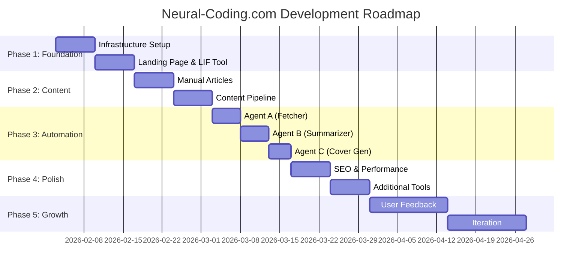

# Neural-Coding.com Development Roadmap

## Overview

This document outlines the phased development plan for neural-coding.com, including detailed weekly tasks, success metrics, and risk mitigation strategies.

---

## Timeline Overview



---

## Week 1-2: Foundation (Detailed)

### Week 1: Infrastructure Setup

#### Day 1-2: Cloudflare Configuration

| Task | Owner | Status | Notes |
|------|-------|--------|-------|
| Register/transfer neural-coding.com | DevOps | Pending | Use Cloudflare Registrar |
| Configure DNS records | DevOps | Pending | A, AAAA, CNAME |
| Enable Cloudflare proxy | DevOps | Pending | Orange cloud |
| Create D1 database `neural_coding_prod` | DevOps | Pending | |
| Create R2 bucket `neural-coding-assets` | DevOps | Pending | |
| Set up wrangler authentication | DevOps | Pending | `wrangler login` |

```bash
# Day 1-2 Commands
wrangler d1 create neural_coding_prod
wrangler r2 bucket create neural-coding-assets
wrangler d1 execute neural_coding_prod --remote --file=db/schema.sql
```

#### Day 3-4: VPS Setup

| Task | Owner | Status | Notes |
|------|-------|--------|-------|
| Provision Hetzner CX22 | DevOps | Pending | Falkenstein DC |
| Configure SSH key access | DevOps | Pending | Disable password auth |
| Install Docker Engine | DevOps | Pending | Latest stable |
| Install Docker Compose | DevOps | Pending | v2.x |
| Configure UFW firewall | DevOps | Pending | Allow 22, 80, 443 |
| Clone repository | DevOps | Pending | /opt/neural-coding |

```bash
# Day 3-4 Commands (on VPS)
apt update && apt upgrade -y
apt install -y docker.io docker-compose-v2 ufw
ufw allow 22/tcp
ufw allow 80/tcp
ufw allow 443/tcp
ufw enable
git clone https://github.com/neural-coding/neural-coding.com /opt/neural-coding
```

#### Day 5-6: Initial Deployment

| Task | Owner | Status | Notes |
|------|-------|--------|-------|
| Deploy Worker API | Backend | Pending | `wrangler deploy` |
| Deploy Pages site (placeholder) | Frontend | Pending | Basic landing |
| Deploy LIF Explorer container | Backend | Pending | Docker Compose |
| Configure Caddy reverse proxy | DevOps | Pending | SSL auto |
| Verify health endpoints | QA | Pending | /api/health |
| Set up GitHub Actions | DevOps | Pending | CI/CD pipeline |

```bash
# Day 5-6 Commands
cd apps/api && wrangler deploy
cd apps/web && pnpm build
wrangler pages deploy apps/web/dist --project-name=neural-coding-web

# On VPS
cd /opt/neural-coding/infra
docker compose up -d
```

#### Day 7: Testing & Documentation

| Task | Owner | Status | Notes |
|------|-------|--------|-------|
| End-to-end smoke tests | QA | Pending | All endpoints |
| SSL certificate verification | DevOps | Pending | tools.neural-coding.com |
| Document deployment process | DevOps | Pending | Update runbooks |
| Set up monitoring alerts | DevOps | Pending | Cloudflare notifications |

### Week 2: Landing Page & First Tool

#### Day 8-9: Landing Page

| Task | Owner | Status | Notes |
|------|-------|--------|-------|
| Design hero section | Design | Pending | Figma mockup |
| Implement neuron animation | Frontend | Pending | Canvas-based |
| Create tool cards component | Frontend | Pending | 4 tools |
| Implement responsive layout | Frontend | Pending | Mobile-first |
| Add meta tags & OG images | Frontend | Pending | SEO basics |

#### Day 10-11: LIF Explorer Enhancement

| Task | Owner | Status | Notes |
|------|-------|--------|-------|
| Add parameter validation | Backend | Pending | Range checks |
| Implement JSON export | Backend | Pending | Download button |
| Implement Brian2 export | Backend | Pending | Code generation |
| Add help tooltips | Frontend | Pending | Parameter explanations |
| Mobile responsive layout | Frontend | Pending | Stack on small screens |

#### Day 12-13: API Integration

| Task | Owner | Status | Notes |
|------|-------|--------|-------|
| Implement /api/v1/playground/tools | Backend | Done | Tool metadata |
| Connect landing page to API | Frontend | Pending | Fetch tools |
| Add loading states | Frontend | Pending | Skeleton UI |
| Error handling | Frontend | Pending | Graceful fallbacks |

#### Day 14: Week 2 Review

| Task | Owner | Status | Notes |
|------|-------|--------|-------|
| Cross-browser testing | QA | Pending | Chrome, Firefox, Safari |
| Performance audit | QA | Pending | Lighthouse score |
| Accessibility audit | QA | Pending | WCAG 2.1 AA |
| Stakeholder demo | PM | Pending | Show progress |

---

## Week 3-4: Content & Automation (Detailed)

### Week 3: Manual Content & Learn Section

#### Day 15-16: Learn Section SSR

| Task | Owner | Status | Notes |
|------|-------|--------|-------|
| Implement /learn index SSR | Backend | Done | Article list |
| Implement /learn/:slug SSR | Backend | Done | Article detail |
| Add JSON-LD structured data | Backend | Pending | Article schema |
| Add OpenGraph meta tags | Backend | Pending | Social sharing |

#### Day 17-18: Manual Articles

| Task | Owner | Status | Notes |
|------|-------|--------|-------|
| Write: "Understanding LIF Model" | Content | Pending | Tutorial |
| Write: "What is Neural Coding?" | Content | Pending | Explainer |
| Write: "Hebbian Learning Basics" | Content | Pending | Tutorial |
| Create cover images | Design | Pending | 3 images |
| Publish to D1 | Content | Pending | Manual insert |

#### Day 19-21: Content Pipeline Setup

| Task | Owner | Status | Notes |
|------|-------|--------|-------|
| Set OPENAI_API_KEY secret | DevOps | Pending | wrangler secret |
| Set ADMIN_TOKEN secret | DevOps | Pending | wrangler secret |
| Test /api/internal/demo/publish | Backend | Pending | Create test article |
| Test /api/internal/demo/cover | Backend | Pending | Generate test cover |
| Verify R2 asset delivery | Backend | Pending | /assets/* route |

### Week 4: Automation Agents

#### Day 22-23: Agent A (Fetcher)

| Task | Owner | Status | Notes |
|------|-------|--------|-------|
| Implement arXiv API client | Backend | Done | fetchArxiv() |
| Implement OpenReview client | Backend | Done | fetchOpenReview() |
| Test paper ingestion | Backend | Pending | Manual trigger |
| Verify deduplication | Backend | Pending | UNIQUE constraint |
| Add error handling | Backend | Pending | Retry logic |

#### Day 24-25: Agent B (Summarizer)

| Task | Owner | Status | Notes |
|------|-------|--------|-------|
| Implement summarizeToArticle() | Backend | Done | OpenAI chat |
| Test JSON output parsing | Backend | Pending | Edge cases |
| Tune prompt for quality | Backend | Pending | Iterate |
| Add job tracking | Backend | Done | jobs table |

#### Day 26-27: Agent C (Cover Generator)

| Task | Owner | Status | Notes |
|------|-------|--------|-------|
| Implement generateCover() | Backend | Done | OpenAI image |
| Test R2 upload | Backend | Pending | Verify storage |
| Optimize image prompt | Backend | Pending | Consistent style |
| Add fallback handling | Backend | Pending | On API failure |

#### Day 28: Cron Activation

| Task | Owner | Status | Notes |
|------|-------|--------|-------|
| Enable cron trigger | DevOps | Pending | Every 6 hours |
| Monitor first automated run | Backend | Pending | Check logs |
| Verify article quality | Content | Pending | Manual review |
| Adjust rate limits | Backend | Pending | maxPapersToProcess |

---

## Month 2+: Expansion (Detailed)

### Week 5-6: Additional Tools

| Tool | Priority | Complexity | Status |
|------|----------|------------|--------|
| Synaptic Weight Visualizer | High | Medium | Pending |
| Neural Code Transpiler | Medium | High | Pending |
| Neuro Data Formatter | Low | High | Pending |

#### Synaptic Weight Visualizer Tasks

- [ ] Implement Hebbian learning simulation
- [ ] Add Oja's rule option
- [ ] Add BCM rule option
- [ ] Create weight matrix heatmap
- [ ] Add weight evolution animation
- [ ] Implement JSON export
- [ ] Write documentation

#### Neural Code Transpiler Tasks

- [ ] Define supported Python subset
- [ ] Implement AST parser
- [ ] Create Brian2 code generator
- [ ] Create Norse code generator
- [ ] Add syntax highlighting
- [ ] Implement copy-to-clipboard
- [ ] Write documentation

### Week 7-8: SEO & Performance

| Task | Owner | Priority | Status |
|------|-------|----------|--------|
| Implement sitemap.xml | Backend | High | Pending |
| Implement RSS feed | Backend | Medium | Pending |
| Add canonical URLs | Frontend | High | Pending |
| Optimize Core Web Vitals | Frontend | High | Pending |
| Add image lazy loading | Frontend | Medium | Pending |
| Implement service worker | Frontend | Low | Pending |

### Week 9-12: Growth & Iteration

| Task | Owner | Priority | Status |
|------|-------|----------|--------|
| Set up analytics dashboard | DevOps | High | Pending |
| Implement feedback widget | Frontend | Medium | Pending |
| A/B test landing page | PM | Medium | Pending |
| Content calendar execution | Content | High | Pending |
| Community outreach | Marketing | Medium | Pending |
| Backlink building | Marketing | Medium | Pending |

---

## Success Metrics

### Week 2 Milestones

| Metric | Target | Measurement |
|--------|--------|-------------|
| Landing page live | Yes | Manual check |
| LIF Explorer functional | Yes | Manual test |
| Health endpoints responding | Yes | curl test |
| SSL certificates valid | Yes | Browser check |
| Lighthouse performance | > 80 | Lighthouse audit |

### Week 4 Milestones

| Metric | Target | Measurement |
|--------|--------|-------------|
| Manual articles published | 3 | D1 query |
| Automated articles generated | 5+ | D1 query |
| Cover images generated | 5+ | R2 list |
| Cron job running | Yes | Worker logs |
| Zero critical errors | Yes | Error monitoring |

### Month 1 Milestones

| Metric | Target | Measurement |
|--------|--------|-------------|
| Unique visitors | 100 | Cloudflare Analytics |
| Tool sessions | 10 | Custom tracking |
| Articles published | 15+ | D1 query |
| Avg. time on page | > 2 min | Analytics |
| Bounce rate | < 70% | Analytics |

### Month 3 Milestones

| Metric | Target | Measurement |
|--------|--------|-------------|
| Unique visitors | 1,000 | Analytics |
| Tool sessions | 100 | Custom tracking |
| Articles published | 50+ | D1 query |
| Organic search traffic | 30% | Analytics |
| Backlinks | 20+ | Ahrefs/SEMrush |

### Month 6 Milestones

| Metric | Target | Measurement |
|--------|--------|-------------|
| Unique visitors | 5,000 | Analytics |
| Tool sessions | 500 | Custom tracking |
| Articles published | 100+ | D1 query |
| Domain authority | 20+ | Moz/Ahrefs |
| Newsletter subscribers | 100 | Email list |

---

## Risk Mitigation

### Technical Risks

| Risk | Probability | Impact | Mitigation |
|------|-------------|--------|------------|
| Streamlit memory leaks | Medium | High | Health checks + auto-restart |
| D1 row limits (5M) | Low | High | Partition by year, archive old |
| OpenAI API rate limits | Medium | Medium | Implement backoff, queue |
| OpenAI API cost overrun | Medium | Medium | Hard daily limits, monitoring |
| VPS downtime | Low | High | Health checks, alerts |
| Cloudflare outage | Very Low | Critical | Accept risk (no self-hosted fallback) |

### Content Risks

| Risk | Probability | Impact | Mitigation |
|------|-------------|--------|------------|
| AI hallucinations | Medium | High | Manual review queue |
| Copyright issues | Low | High | Only use arXiv (open access) |
| Low content quality | Medium | Medium | Tune prompts, human review |
| Duplicate content | Low | Medium | Deduplication in pipeline |

### Business Risks

| Risk | Probability | Impact | Mitigation |
|------|-------------|--------|------------|
| No user traction | Medium | Critical | Pivot trigger at week 4 |
| Competitor launch | Low | Medium | Focus on niche, quality |
| Scope creep | High | Medium | Strict MVP definition |
| Team burnout | Medium | High | Realistic timelines |

### Pivot Triggers

| Condition | Threshold | Action |
|-----------|-----------|--------|
| Week 4 visitors | < 50 | Reassess content strategy |
| Month 1 tool usage | < 5 sessions | Simplify or remove tools |
| Month 2 organic traffic | < 10% | Invest in SEO or paid |
| Month 3 engagement | < 1 min avg | Redesign content format |

---

## Resource Allocation

### Team Roles

| Role | Responsibilities | Time Allocation |
|------|------------------|-----------------|
| Backend Developer | Workers, APIs, Pipeline | 60% |
| Frontend Developer | Astro, Components, UX | 30% |
| DevOps | Infrastructure, CI/CD | 10% |
| Content | Articles, Review | 20% (after week 2) |

### Budget Allocation (Monthly)

| Category | Budget | Notes |
|----------|--------|-------|
| Infrastructure | $5 | VPS |
| AI APIs | $30 | OpenAI |
| Domain | $1 | Amortized |
| Tools | $0 | Free tiers |
| **Total** | **$36** | |

---

## Communication Plan

### Weekly Sync

- **When**: Every Monday, 10:00 AM
- **Duration**: 30 minutes
- **Agenda**:
  1. Previous week accomplishments
  2. Current week priorities
  3. Blockers and risks
  4. Metrics review

### Daily Standup (Week 1-4)

- **When**: Daily, 9:00 AM
- **Duration**: 15 minutes
- **Format**: Async in Slack/Discord
- **Template**:
  - Yesterday: [completed tasks]
  - Today: [planned tasks]
  - Blockers: [any blockers]

### Milestone Reviews

| Milestone | Date | Attendees | Deliverables |
|-----------|------|-----------|--------------|
| Week 2 Review | Day 14 | All | Demo, metrics |
| Week 4 Review | Day 28 | All | Demo, metrics, pivot decision |
| Month 2 Review | Day 60 | All | Full review, roadmap update |

---

## Definition of Done

### Feature Complete

- [ ] Code implemented and working
- [ ] Unit tests passing
- [ ] Integration tests passing
- [ ] Code reviewed and approved
- [ ] Documentation updated
- [ ] Deployed to staging
- [ ] QA approved
- [ ] Deployed to production

### Sprint Complete

- [ ] All planned tasks completed or deferred with reason
- [ ] No critical bugs open
- [ ] Metrics collected and reviewed
- [ ] Retrospective conducted
- [ ] Next sprint planned
