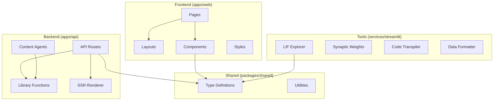
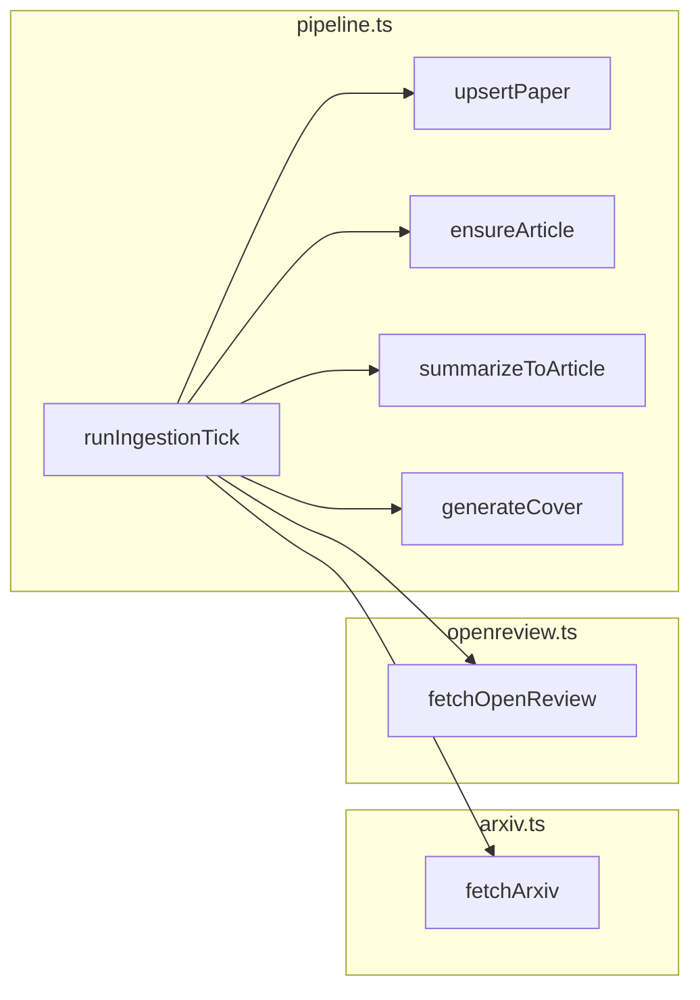
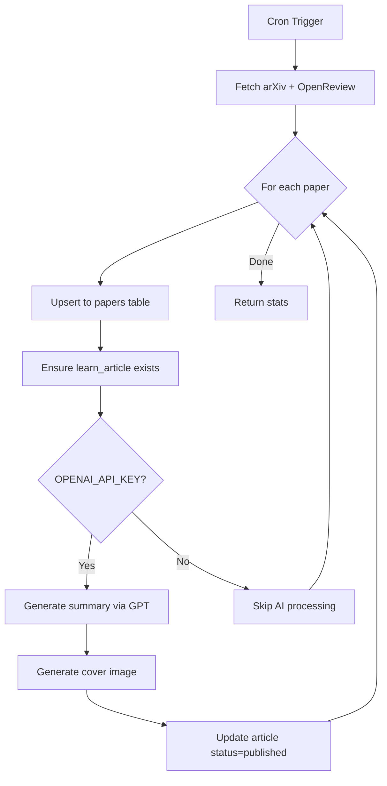
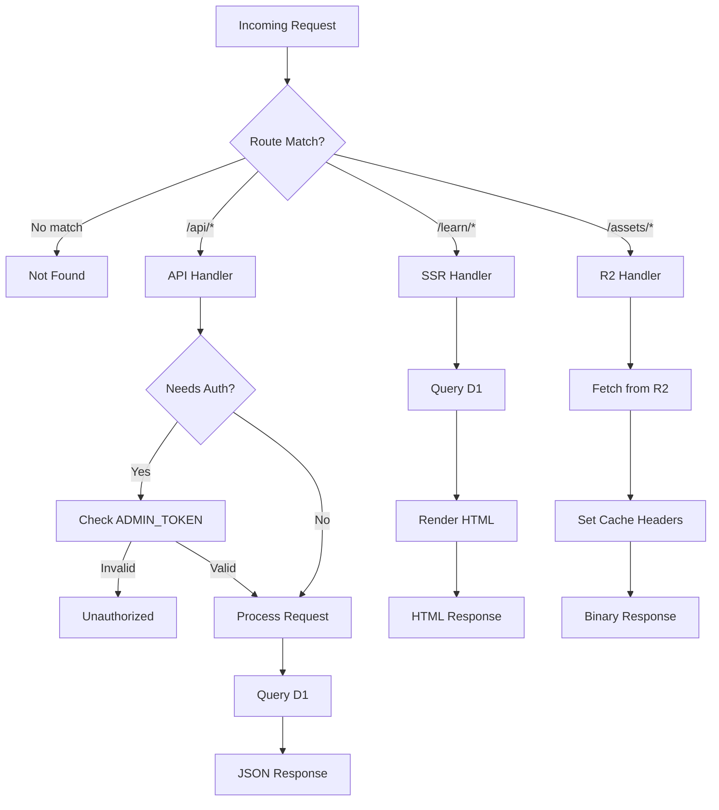
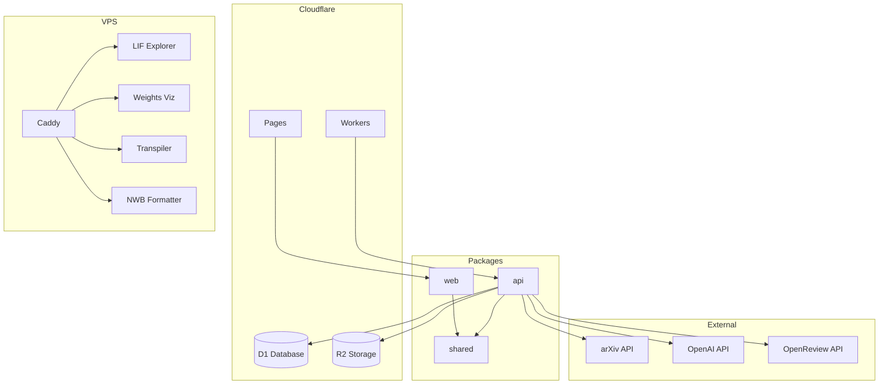
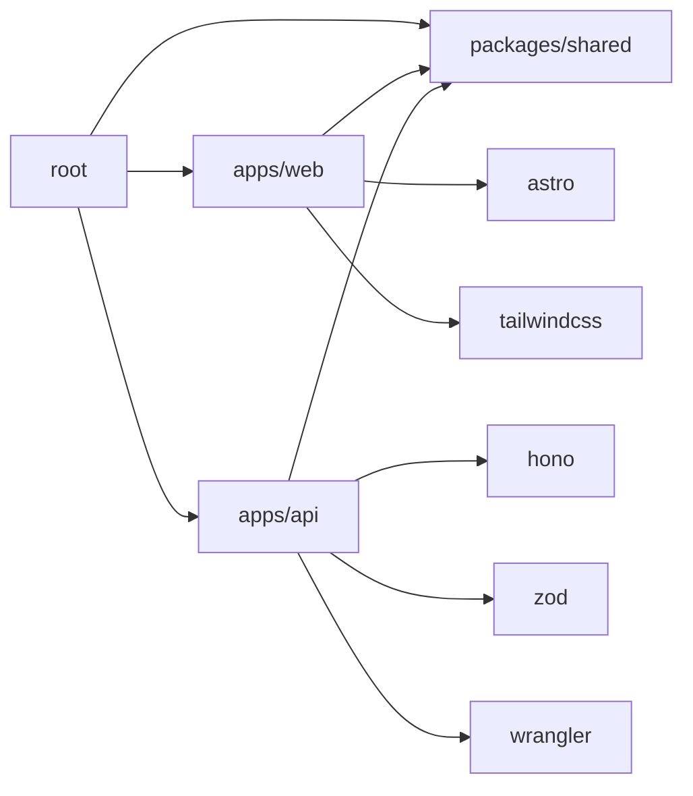

# Neural-Coding.com Module Design

## Overview

This document defines the modular architecture of neural-coding.com, including frontend components, backend services, worker functions, and testing strategies.

---

## System Module Overview



---

## Frontend Component Hierarchy

### Directory Structure

```
apps/web/
├── src/
│   ├── layouts/
│   │   └── BaseLayout.astro        # Main HTML shell
│   ├── pages/
│   │   ├── index.astro             # Landing page
│   │   ├── playground/
│   │   │   └── index.astro         # Tools listing
│   │   ├── api/
│   │   │   └── index.astro         # API documentation
│   │   └── [...slug].astro         # Dynamic routes (future)
│   ├── components/
│   │   ├── Header.astro            # Site header
│   │   ├── Footer.astro            # Site footer
│   │   ├── Hero.astro              # Landing hero section
│   │   ├── ToolCard.astro          # Tool preview card
│   │   ├── ArticleCard.astro       # Article preview card
│   │   ├── NeuronAnimation.astro   # 3D neuron canvas
│   │   └── CodeBlock.astro         # Syntax highlighted code
│   ├── styles/
│   │   └── global.css              # Global styles + Tailwind
│   └── lib/
│       ├── api.ts                  # API client functions
│       └── constants.ts            # Site constants
├── public/
│   ├── favicon.svg
│   └── og-image.png
├── astro.config.mjs
├── tailwind.config.mjs
└── package.json
```

### Component Specifications

#### BaseLayout.astro

```astro
---
// File: apps/web/src/layouts/BaseLayout.astro
interface Props {
  title: string;
  description?: string;
  ogImage?: string;
}

const { title, description = "Computational neuroscience for developers", ogImage } = Astro.props;
const canonicalURL = new URL(Astro.url.pathname, Astro.site);
---

<!DOCTYPE html>
<html lang="en">
<head>
  <meta charset="UTF-8" />
  <meta name="viewport" content="width=device-width, initial-scale=1.0" />
  <link rel="icon" type="image/svg+xml" href="/favicon.svg" />
  <link rel="canonical" href={canonicalURL} />

  <title>{title} | Neural-Coding</title>
  <meta name="description" content={description} />

  <!-- Open Graph -->
  <meta property="og:type" content="website" />
  <meta property="og:url" content={canonicalURL} />
  <meta property="og:title" content={title} />
  <meta property="og:description" content={description} />
  {ogImage && <meta property="og:image" content={ogImage} />}

  <!-- Twitter -->
  <meta name="twitter:card" content="summary_large_image" />
  <meta name="twitter:title" content={title} />
  <meta name="twitter:description" content={description} />
</head>
<body class="min-h-screen bg-gray-950 text-gray-100">
  <Header />
  <main>
    <slot />
  </main>
  <Footer />
</body>
</html>
```

#### ToolCard.astro

```astro
---
// File: apps/web/src/components/ToolCard.astro
import type { ToolMeta } from "@neural-coding/shared";

interface Props {
  tool: ToolMeta;
}

const { tool } = Astro.props;

const statusColors = {
  alpha: "bg-yellow-500/20 text-yellow-400",
  beta: "bg-blue-500/20 text-blue-400",
  stable: "bg-green-500/20 text-green-400"
};
---

<a
  href={tool.path}
  target="_blank"
  rel="noopener noreferrer"
  class="block p-6 bg-gray-900 rounded-lg border border-gray-800 hover:border-cyan-500 transition-colors"
>
  <div class="flex items-start justify-between mb-3">
    <h3 class="text-lg font-semibold text-white">{tool.name}</h3>
    <span class={`px-2 py-1 text-xs rounded ${statusColors[tool.status]}`}>
      {tool.status}
    </span>
  </div>
  <p class="text-gray-400 text-sm">{tool.description}</p>
</a>
```

#### NeuronAnimation.astro

```astro
---
// File: apps/web/src/components/NeuronAnimation.astro
// Canvas-based neuron network animation for landing page
---

<div id="neuron-canvas" class="absolute inset-0 -z-10 opacity-30"></div>

<script>
  const canvas = document.getElementById('neuron-canvas') as HTMLCanvasElement;
  if (canvas) {
    const ctx = canvas.getContext('2d');
    if (ctx) {
      // Resize canvas to window
      const resize = () => {
        canvas.width = window.innerWidth;
        canvas.height = window.innerHeight;
      };
      resize();
      window.addEventListener('resize', resize);

      // Neuron nodes
      const nodes: { x: number; y: number; vx: number; vy: number }[] = [];
      const nodeCount = 50;

      for (let i = 0; i < nodeCount; i++) {
        nodes.push({
          x: Math.random() * canvas.width,
          y: Math.random() * canvas.height,
          vx: (Math.random() - 0.5) * 0.5,
          vy: (Math.random() - 0.5) * 0.5
        });
      }

      // Animation loop
      const animate = () => {
        ctx.clearRect(0, 0, canvas.width, canvas.height);

        // Update and draw nodes
        for (const node of nodes) {
          node.x += node.vx;
          node.y += node.vy;

          // Bounce off edges
          if (node.x < 0 || node.x > canvas.width) node.vx *= -1;
          if (node.y < 0 || node.y > canvas.height) node.vy *= -1;

          // Draw node
          ctx.beginPath();
          ctx.arc(node.x, node.y, 3, 0, Math.PI * 2);
          ctx.fillStyle = '#06b6d4';
          ctx.fill();
        }

        // Draw connections
        for (let i = 0; i < nodes.length; i++) {
          for (let j = i + 1; j < nodes.length; j++) {
            const dx = nodes[i].x - nodes[j].x;
            const dy = nodes[i].y - nodes[j].y;
            const dist = Math.sqrt(dx * dx + dy * dy);

            if (dist < 150) {
              ctx.beginPath();
              ctx.moveTo(nodes[i].x, nodes[i].y);
              ctx.lineTo(nodes[j].x, nodes[j].y);
              ctx.strokeStyle = `rgba(6, 182, 212, ${1 - dist / 150})`;
              ctx.lineWidth = 1;
              ctx.stroke();
            }
          }
        }

        requestAnimationFrame(animate);
      };

      animate();
    }
  }
</script>
```

---

## Backend Service Breakdown

### Directory Structure

```
apps/api/
├── src/
│   ├── index.ts                    # Main entry point (Hono app)
│   ├── env.ts                      # Environment type definitions
│   ├── db.ts                       # Database query functions
│   ├── render.ts                   # SSR HTML rendering
│   ├── agents/
│   │   ├── pipeline.ts             # Main ingestion pipeline
│   │   ├── arxiv.ts                # arXiv API client
│   │   └── openreview.ts           # OpenReview API client
│   └── lib/
│       ├── auth.ts                 # Admin authentication
│       ├── time.ts                 # Time utilities
│       ├── ids.ts                  # ID generation (ULID)
│       └── openai.ts               # OpenAI API client
├── migrations/
│   └── 0001_init.sql               # Initial schema migration
├── wrangler.toml                   # Cloudflare Worker config
├── tsconfig.json
└── package.json
```

### Service Modules

#### API Routes Module (index.ts)

| Route | Method | Handler | Description |
|-------|--------|---------|-------------|
| `/api/health` | GET | inline | Legacy health check |
| `/api/v1/health` | GET | inline | Health check |
| `/api/v1/playground/tools` | GET | inline | List tools |
| `/api/v1/brain-context` | POST | inline | Term explanation |
| `/api/v1/learn/posts` | GET | inline | List articles |
| `/api/v1/learn/posts/:slug` | GET | inline | Get article |
| `/learn` | GET | `renderLearnIndex` | SSR article list |
| `/learn/:slug` | GET | `renderLearnArticle` | SSR article detail |
| `/assets/*` | GET | inline | R2 asset delivery |
| `/api/internal/ingest/tick` | POST | `runIngestionTick` | Trigger ingestion |
| `/api/internal/demo/publish` | POST | inline | Publish demo |
| `/api/internal/demo/cover` | POST | inline | Generate cover |

#### Database Module (db.ts)

```typescript
// File: apps/api/src/db.ts

// Query functions
export async function getLearnArticles(env: Env): Promise<LearnArticleRow[]>;
export async function getLearnArticleBySlug(env: Env, slug: string): Promise<LearnArticleRow | null>;
export async function upsertTermExplanation(env: Env, params: {...}): Promise<void>;
export async function getTermExplanation(env: Env, term: string): Promise<{...} | null>;
```

#### Agents Module (agents/)



#### Library Module (lib/)

| File | Functions | Purpose |
|------|-----------|---------|
| `auth.ts` | `requireAdmin` | Admin token validation |
| `time.ts` | `nowIso` | ISO timestamp generation |
| `ids.ts` | `newId` | ULID generation |
| `openai.ts` | `openAiChat`, `openAiImage` | OpenAI API calls |

---

## Worker Function Specifications

### Scheduled Worker (Cron)

```typescript
// Triggered by: crons = ["0 */6 * * *"] (every 6 hours)

export default {
  scheduled: async (event: ScheduledEvent, env: Env, ctx: ExecutionContext) => {
    ctx.waitUntil(runIngestionTick(env, {
      maxResults: 10,      // Max papers to fetch from arXiv
      maxPapersToProcess: 1 // Max papers to summarize per tick
    }));
  }
};
```

### Ingestion Pipeline Flow



### Request Handler Flow



---

## Tool Modules (Streamlit)

### Directory Structure

```
services/streamlit/
├── lif-explorer/
│   ├── app.py                      # Main Streamlit app
│   ├── Dockerfile
│   └── requirements.txt
├── synaptic-weight-visualizer/
│   ├── app.py
│   ├── Dockerfile
│   └── requirements.txt
├── neural-code-transpiler/
│   ├── app.py
│   ├── Dockerfile
│   └── requirements.txt
└── neuro-data-formatter/
    ├── app.py
    ├── Dockerfile
    └── requirements.txt
```

### LIF Explorer Module

```python
# File: services/streamlit/lif-explorer/app.py

# Dependencies
import numpy as np
import matplotlib.pyplot as plt
import streamlit as st

# Parameters
- tau_ms: float (1.0 - 100.0)      # Membrane time constant
- dt_ms: float (0.05 - 2.0)        # Simulation timestep
- t_ms: float (50.0 - 2000.0)      # Total simulation time
- v_rest: float (-1.0 - 1.0)       # Resting potential
- v_reset: float (-1.0 - 1.0)      # Reset potential
- v_th: float (-1.0 - 2.0)         # Threshold potential
- i_dc: float (-1.0 - 3.0)         # DC input current
- noise: float (0.0 - 1.0)         # Noise sigma

# Outputs
- Membrane potential plot (Matplotlib)
- Spike count
- Spike train chart
```

### Synaptic Weight Visualizer Module

```python
# File: services/streamlit/synaptic-weight-visualizer/app.py

# Dependencies
import numpy as np
import matplotlib.pyplot as plt
import streamlit as st

# Parameters
- n_pre: int (2 - 20)              # Pre-synaptic neurons
- n_post: int (2 - 20)             # Post-synaptic neurons
- learning_rate: float (0.01 - 1.0)
- n_epochs: int (1 - 100)
- rule: enum [hebbian, oja, bcm]

# Outputs
- Weight matrix heatmap
- Weight evolution plot
- Export button (JSON)
```

### Neural Code Transpiler Module

```python
# File: services/streamlit/neural-code-transpiler/app.py

# Dependencies
import streamlit as st
import ast

# Inputs
- source_code: str (Python pseudocode)
- target: enum [brian2, norse]

# Outputs
- Transpiled code
- Syntax highlighting
- Copy button
```

### Neuro Data Formatter Module

```python
# File: services/streamlit/neuro-data-formatter/app.py

# Dependencies
import streamlit as st
import pandas as pd
import pynwb

# Inputs
- csv_file: UploadedFile
- field_mapping: dict
- metadata: dict

# Outputs
- Validation results
- NWB file download
```

---

## Dependency Graph



---

## Testing Strategy Per Module

### Frontend Testing (apps/web)

| Test Type | Tool | Coverage Target |
|-----------|------|-----------------|
| Unit | Vitest | Component logic |
| Component | Astro Test Utils | Rendering |
| E2E | Playwright | User flows |
| Visual | Percy (optional) | UI regression |

```typescript
// File: apps/web/src/components/__tests__/ToolCard.test.ts
import { experimental_AstroContainer as AstroContainer } from 'astro/container';
import { expect, test } from 'vitest';
import ToolCard from '../ToolCard.astro';

test('ToolCard renders tool name', async () => {
  const container = await AstroContainer.create();
  const result = await container.renderToString(ToolCard, {
    props: {
      tool: {
        id: 'lif-explorer',
        name: 'LIF Explorer',
        description: 'Test description',
        path: 'https://example.com',
        status: 'alpha'
      }
    }
  });

  expect(result).toContain('LIF Explorer');
  expect(result).toContain('alpha');
});
```

### Backend Testing (apps/api)

| Test Type | Tool | Coverage Target |
|-----------|------|-----------------|
| Unit | Vitest | Business logic |
| Integration | Miniflare | D1/R2 operations |
| API | Vitest + Hono | Endpoint behavior |

```typescript
// File: apps/api/src/__tests__/db.test.ts
import { describe, it, expect, beforeAll } from 'vitest';
import { Miniflare } from 'miniflare';

describe('Database functions', () => {
  let mf: Miniflare;
  let env: any;

  beforeAll(async () => {
    mf = new Miniflare({
      modules: true,
      script: '',
      d1Databases: ['DB']
    });
    env = await mf.getBindings();

    // Initialize schema
    await env.DB.exec(`
      CREATE TABLE learn_articles (
        slug TEXT PRIMARY KEY,
        title TEXT NOT NULL,
        status TEXT NOT NULL DEFAULT 'draft'
      )
    `);
  });

  it('should return empty array when no articles', async () => {
    const result = await env.DB.prepare(
      "SELECT * FROM learn_articles WHERE status = 'published'"
    ).all();
    expect(result.results).toEqual([]);
  });
});
```

### Tool Testing (services/streamlit)

| Test Type | Tool | Coverage Target |
|-----------|------|-----------------|
| Unit | pytest | Simulation logic |
| Integration | pytest + streamlit | Widget behavior |
| E2E | Playwright | Full app flow |

```python
# File: services/streamlit/lif-explorer/test_app.py
import numpy as np
import pytest

def simulate_lif(tau, dt, T, v_rest, v_reset, v_th, i_dc, noise_sigma):
    """Copy of simulation function for testing"""
    n = int(np.ceil(T / dt))
    t = np.arange(n) * dt
    v = np.zeros(n, dtype=np.float32)
    v[0] = v_rest
    spikes = np.zeros(n, dtype=np.int8)

    alpha = dt / tau
    for k in range(1, n):
        dv = alpha * (-(v[k - 1] - v_rest) + i_dc)
        v[k] = v[k - 1] + dv
        if v[k] >= v_th:
            spikes[k] = 1
            v[k] = v_reset
    return t, v, spikes

def test_lif_no_spikes_below_threshold():
    """Test that no spikes occur when input is below threshold"""
    t, v, spikes = simulate_lif(
        tau=20, dt=0.1, T=100,
        v_rest=0, v_reset=0, v_th=1,
        i_dc=0.5, noise_sigma=0
    )
    assert spikes.sum() == 0

def test_lif_spikes_above_threshold():
    """Test that spikes occur when input exceeds threshold"""
    t, v, spikes = simulate_lif(
        tau=20, dt=0.1, T=100,
        v_rest=0, v_reset=0, v_th=1,
        i_dc=1.5, noise_sigma=0
    )
    assert spikes.sum() > 0

def test_lif_reset_after_spike():
    """Test that voltage resets after spike"""
    t, v, spikes = simulate_lif(
        tau=20, dt=0.1, T=100,
        v_rest=0, v_reset=-0.5, v_th=1,
        i_dc=1.5, noise_sigma=0
    )
    spike_indices = np.where(spikes == 1)[0]
    for idx in spike_indices:
        assert v[idx] == -0.5
```

---

## Module Communication

### API Client (Frontend to Backend)

```typescript
// File: apps/web/src/lib/api.ts

const API_BASE = import.meta.env.PUBLIC_API_BASE || '';

export async function fetchTools() {
  const res = await fetch(`${API_BASE}/api/v1/playground/tools`);
  if (!res.ok) throw new Error('Failed to fetch tools');
  return res.json();
}

export async function fetchArticles() {
  const res = await fetch(`${API_BASE}/api/v1/learn/posts`);
  if (!res.ok) throw new Error('Failed to fetch articles');
  return res.json();
}

export async function fetchArticle(slug: string) {
  const res = await fetch(`${API_BASE}/api/v1/learn/posts/${slug}`);
  if (!res.ok) throw new Error('Failed to fetch article');
  return res.json();
}

export async function explainTerm(term: string, lang: 'zh' | 'en' = 'zh') {
  const res = await fetch(`${API_BASE}/api/v1/brain-context`, {
    method: 'POST',
    headers: { 'Content-Type': 'application/json' },
    body: JSON.stringify({ term, lang })
  });
  if (!res.ok) throw new Error('Failed to explain term');
  return res.json();
}
```

### Shared Types Package

```typescript
// File: packages/shared/src/index.ts

export * from './types';

// Re-export for convenience
export type {
  ToolId,
  ToolMeta,
  LearnArticle,
  Paper,
  Job,
  JobKind,
  JobStatus
} from './types';
```

---

## Build Configuration

### Monorepo Structure

```json
// File: package.json (root)
{
  "name": "neural-coding.com",
  "private": true,
  "packageManager": "pnpm@10.27.0",
  "scripts": {
    "dev": "pnpm -r dev",
    "build": "pnpm -r build",
    "test": "pnpm -r test",
    "lint": "pnpm -r lint"
  }
}
```

```yaml
# File: pnpm-workspace.yaml
packages:
  - 'apps/*'
  - 'packages/*'
```

### Package Dependencies


