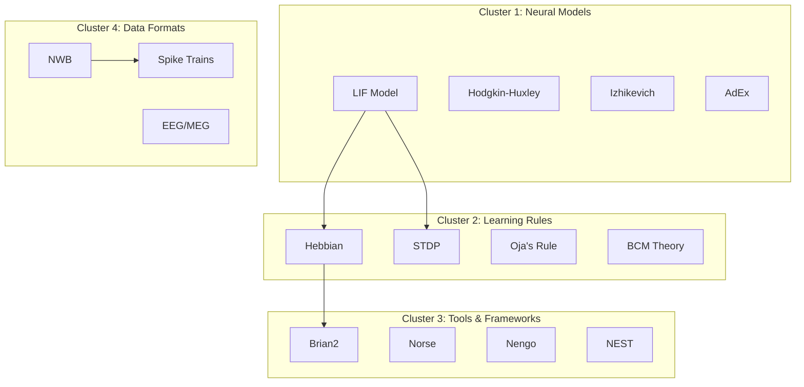

# Neural-Coding.com SEO & Content Strategy

## Overview

This document defines the SEO strategy, content calendar, and technical implementation for neural-coding.com to achieve organic search visibility in the computational neuroscience and neuromorphic computing space.

---

## Keyword Research

### Primary Keywords

| Keyword | Monthly Volume | Difficulty | Intent |
|---------|---------------|------------|--------|
| leaky integrate and fire model | 1,200 | Low | Educational |
| spiking neural network tutorial | 800 | Medium | Educational |
| neuromorphic computing | 2,400 | High | Informational |
| brian2 tutorial | 400 | Low | Educational |
| hebbian learning python | 300 | Low | Educational |
| neural coding | 1,800 | High | Informational |
| spike train analysis | 500 | Low | Educational |
| NWB format | 200 | Low | Technical |

### Long-Tail Keywords

| Keyword | Volume | Target Page |
|---------|--------|-------------|
| how to simulate lif neuron python | 150 | /learn/lif-neuron-simulation |
| convert csv to nwb format | 80 | /playground (NWB tool) |
| hebbian learning rule implementation | 120 | /learn/hebbian-learning-code |
| spiking neural network vs ann | 200 | /learn/snn-vs-ann |
| neuromorphic hardware comparison | 100 | /learn/neuromorphic-chips |
| brian2 vs norse comparison | 50 | /learn/brian2-norse-comparison |

### Semantic Keyword Clusters



---

## Content Calendar (3 Months)

### Month 1: Foundation Content

| Week | Article Title | Target Keyword | Type |
|------|--------------|----------------|------|
| 1 | Understanding the Leaky Integrate-and-Fire Model | lif model python | Tutorial |
| 1 | What is Neural Coding? A Developer's Introduction | neural coding basics | Explainer |
| 2 | Hebbian Learning: From Biology to Code | hebbian learning python | Tutorial |
| 2 | Spike Trains 101: Encoding Information in Neurons | spike train analysis | Explainer |
| 3 | Building Your First Spiking Neural Network | spiking neural network tutorial | Tutorial |
| 3 | Brian2 Quick Start for Python Developers | brian2 tutorial | Tutorial |
| 4 | NWB Format: The Standard for Neuroscience Data | nwb format guide | Technical |
| 4 | LIF vs Hodgkin-Huxley: Choosing the Right Model | neuron model comparison | Comparison |

### Month 2: Intermediate Content

| Week | Article Title | Target Keyword | Type |
|------|--------------|----------------|------|
| 5 | STDP: How Synapses Learn Timing | stdp learning rule | Tutorial |
| 5 | Neuromorphic Computing: Hardware for Brain-Like AI | neuromorphic computing | Explainer |
| 6 | Converting Your Data to NWB Format | csv to nwb python | Tutorial |
| 6 | Rate Coding vs Temporal Coding | neural coding schemes | Explainer |
| 7 | Building a Pattern Recognition SNN | snn pattern recognition | Project |
| 7 | Norse vs Brian2: Which Framework to Choose? | norse brian2 comparison | Comparison |
| 8 | Visualizing Synaptic Weight Evolution | weight visualization | Tutorial |
| 8 | Introduction to Reservoir Computing | reservoir computing | Explainer |

### Month 3: Advanced Content

| Week | Article Title | Target Keyword | Type |
|------|--------------|----------------|------|
| 9 | Implementing BCM Learning Rule | bcm learning python | Tutorial |
| 9 | Intel Loihi vs IBM TrueNorth | neuromorphic chips comparison | Comparison |
| 10 | Event-Driven Simulation Optimization | event driven snn | Technical |
| 10 | Surrogate Gradient Learning for SNNs | surrogate gradient | Tutorial |
| 11 | Building a Neuromorphic MNIST Classifier | snn mnist tutorial | Project |
| 11 | Population Coding in Neural Networks | population coding | Explainer |
| 12 | Deploying SNNs on Edge Devices | snn edge deployment | Technical |
| 12 | The Future of Neuromorphic Computing | neuromorphic future | Opinion |

---

## Article Templates

### Tutorial Article Template

```markdown
---
title: "{Action Verb} {Topic}: {Benefit}"
description: "{150-160 char description with primary keyword}"
slug: "{keyword-slug}"
tags: ["{tag1}", "{tag2}", "{tag3}"]
publishedAt: "{ISO date}"
updatedAt: "{ISO date}"
author: "Neural-Coding Team"
---

# {Title}

{One-liner summary - appears in article cards}

## What You'll Learn

- {Learning outcome 1}
- {Learning outcome 2}
- {Learning outcome 3}

## Prerequisites

- {Prerequisite 1}
- {Prerequisite 2}

## The Code Angle

{2-3 sentences on implementation perspective}

## The Biology Behind It

{2-3 sentences on biological inspiration}

---

## Step 1: {First Step Title}

{Explanation}

```python
# Code example
```

{Explanation of code}

## Step 2: {Second Step Title}

{Continue pattern...}

---

## Complete Code

```python
# Full working example
```

## Try It Yourself

[Launch LIF Explorer](/playground) to experiment with these parameters interactively.

## Key Takeaways

1. {Takeaway 1}
2. {Takeaway 2}
3. {Takeaway 3}

## Further Reading

- [{Related Article 1}](/learn/{slug1})
- [{Related Article 2}](/learn/{slug2})
- [{External Resource}](https://example.com)

---

*This article was generated with AI assistance and reviewed by the Neural-Coding team.*
```

### Explainer Article Template

```markdown
---
title: "What is {Topic}? {Subtitle}"
description: "{150-160 char description}"
slug: "{topic-slug}"
tags: ["{tag1}", "{tag2}"]
publishedAt: "{ISO date}"
---

# What is {Topic}?

{One-liner definition}

## Quick Summary

| Aspect | Description |
|--------|-------------|
| Definition | {Brief definition} |
| Key Concept | {Core idea} |
| Use Case | {Primary application} |
| Code Relevance | {Why developers care} |

## The Basics

{3-4 paragraphs explaining the concept}

## How It Works

{Detailed explanation with diagrams}

```mermaid
{Diagram}
```

## Code Example

```python
# Minimal working example
```

## Common Misconceptions

### Misconception 1: {Title}

{Correction}

### Misconception 2: {Title}

{Correction}

## Real-World Applications

1. **{Application 1}**: {Description}
2. **{Application 2}**: {Description}
3. **{Application 3}**: {Description}

## Related Concepts

- [{Concept 1}](/learn/{slug1}) - {Brief description}
- [{Concept 2}](/learn/{slug2}) - {Brief description}

## References

1. {Academic reference}
2. {Academic reference}
```

---

## JSON-LD Schemas

### Article Schema

```typescript
// File: apps/api/src/render.ts

function generateArticleSchema(article: LearnArticleRow, origin: string) {
  return {
    "@context": "https://schema.org",
    "@type": "TechArticle",
    "headline": article.title,
    "description": article.one_liner,
    "image": article.cover_r2_key
      ? `${origin}/assets/${article.cover_r2_key}`
      : `${origin}/og-image.png`,
    "datePublished": article.created_at,
    "dateModified": article.updated_at,
    "author": {
      "@type": "Organization",
      "name": "Neural-Coding",
      "url": origin
    },
    "publisher": {
      "@type": "Organization",
      "name": "Neural-Coding",
      "logo": {
        "@type": "ImageObject",
        "url": `${origin}/logo.png`
      }
    },
    "mainEntityOfPage": {
      "@type": "WebPage",
      "@id": `${origin}/learn/${article.slug}`
    },
    "keywords": JSON.parse(article.tags_json).join(", "),
    "articleSection": "Computational Neuroscience",
    "inLanguage": "en"
  };
}
```

### Organization Schema

```json
{
  "@context": "https://schema.org",
  "@type": "Organization",
  "name": "Neural-Coding",
  "url": "https://neural-coding.com",
  "logo": "https://neural-coding.com/logo.png",
  "description": "Computational neuroscience education platform for developers",
  "sameAs": [
    "https://github.com/neural-coding",
    "https://twitter.com/neuralcoding"
  ],
  "contactPoint": {
    "@type": "ContactPoint",
    "contactType": "technical support",
    "email": "support@neural-coding.com"
  }
}
```

### Software Application Schema (for tools)

```json
{
  "@context": "https://schema.org",
  "@type": "SoftwareApplication",
  "name": "LIF Explorer",
  "applicationCategory": "EducationalApplication",
  "operatingSystem": "Web Browser",
  "offers": {
    "@type": "Offer",
    "price": "0",
    "priceCurrency": "USD"
  },
  "description": "Interactive Leaky Integrate-and-Fire neuron simulator",
  "url": "https://tools.neural-coding.com/lif/",
  "author": {
    "@type": "Organization",
    "name": "Neural-Coding"
  }
}
```

### FAQ Schema

```json
{
  "@context": "https://schema.org",
  "@type": "FAQPage",
  "mainEntity": [
    {
      "@type": "Question",
      "name": "What is a Leaky Integrate-and-Fire neuron?",
      "acceptedAnswer": {
        "@type": "Answer",
        "text": "A LIF neuron is a simplified mathematical model that captures the essential dynamics of biological neurons: membrane potential integration, threshold-based spiking, and reset after firing."
      }
    },
    {
      "@type": "Question",
      "name": "What is neuromorphic computing?",
      "acceptedAnswer": {
        "@type": "Answer",
        "text": "Neuromorphic computing is a hardware approach that mimics the structure and function of biological neural networks, using specialized chips designed for energy-efficient, parallel processing of spike-based information."
      }
    }
  ]
}
```

---

## Meta Tag Templates

### Article Page Meta Tags

```html
<!-- Primary Meta Tags -->
<title>{title} | Neural-Coding</title>
<meta name="title" content="{title} | Neural-Coding">
<meta name="description" content="{one_liner}">
<meta name="keywords" content="{tags.join(', ')}">
<meta name="author" content="Neural-Coding">
<meta name="robots" content="index, follow">
<link rel="canonical" href="https://neural-coding.com/learn/{slug}">

<!-- Open Graph / Facebook -->
<meta property="og:type" content="article">
<meta property="og:url" content="https://neural-coding.com/learn/{slug}">
<meta property="og:title" content="{title}">
<meta property="og:description" content="{one_liner}">
<meta property="og:image" content="https://neural-coding.com/assets/{cover_r2_key}">
<meta property="og:site_name" content="Neural-Coding">
<meta property="article:published_time" content="{created_at}">
<meta property="article:modified_time" content="{updated_at}">
<meta property="article:section" content="Computational Neuroscience">
<meta property="article:tag" content="{tags[0]}">

<!-- Twitter -->
<meta name="twitter:card" content="summary_large_image">
<meta name="twitter:url" content="https://neural-coding.com/learn/{slug}">
<meta name="twitter:title" content="{title}">
<meta name="twitter:description" content="{one_liner}">
<meta name="twitter:image" content="https://neural-coding.com/assets/{cover_r2_key}">
<meta name="twitter:site" content="@neuralcoding">
```

### Homepage Meta Tags

```html
<title>Neural-Coding | Computational Neuroscience for Developers</title>
<meta name="description" content="Learn computational neuroscience through interactive tools and AI-generated content. Explore LIF neurons, Hebbian learning, and neuromorphic computing.">
<meta name="keywords" content="computational neuroscience, spiking neural networks, neuromorphic computing, brain simulation, neural coding">

<meta property="og:type" content="website">
<meta property="og:url" content="https://neural-coding.com">
<meta property="og:title" content="Neural-Coding | Computational Neuroscience for Developers">
<meta property="og:description" content="Learn computational neuroscience through interactive tools and AI-generated content.">
<meta property="og:image" content="https://neural-coding.com/og-image.png">
```

---

## Internal Linking Strategy

### Link Architecture

```mermaid
graph TB
    HOME[Homepage] --> PLAYGROUND[/playground]
    HOME --> LEARN[/learn]
    HOME --> API[/api]

    PLAYGROUND --> LIF[LIF Explorer]
    PLAYGROUND --> WEIGHTS[Weights Viz]
    PLAYGROUND --> TRANSPILER[Transpiler]
    PLAYGROUND --> NWB[NWB Formatter]

    LEARN --> TUTORIALS[Tutorial Articles]
    LEARN --> EXPLAINERS[Explainer Articles]
    LEARN --> COMPARISONS[Comparison Articles]

    TUTORIALS --> LIF
    EXPLAINERS --> TUTORIALS
    COMPARISONS --> TUTORIALS
```

### Linking Rules

1. **Every article links to at least one tool**
   - LIF tutorials → LIF Explorer
   - Learning rule articles → Weights Visualizer
   - Data format articles → NWB Formatter

2. **Every article links to 2-3 related articles**
   - Use "Further Reading" section
   - Link to prerequisite content
   - Link to advanced follow-up content

3. **Tool pages link back to relevant articles**
   - "Learn more about LIF neurons" → /learn/lif-neuron-simulation

4. **Breadcrumb navigation on all pages**
   ```
   Home > Learn > {Category} > {Article Title}
   ```

### Anchor Text Guidelines

| Link Type | Anchor Text Pattern | Example |
|-----------|---------------------|---------|
| Tutorial | "Learn how to {action}" | "Learn how to simulate LIF neurons" |
| Tool | "Try the {tool name}" | "Try the LIF Explorer" |
| Concept | "{Concept name}" | "Hebbian learning" |
| Comparison | "{A} vs {B}" | "Brian2 vs Norse" |

---

## Technical SEO Implementation

### Sitemap Generation

```typescript
// File: apps/api/src/sitemap.ts

export async function generateSitemap(env: Env): Promise<string> {
  const articles = await getLearnArticles(env);
  const baseUrl = 'https://neural-coding.com';

  const staticPages = [
    { loc: '/', priority: '1.0', changefreq: 'weekly' },
    { loc: '/playground', priority: '0.9', changefreq: 'monthly' },
    { loc: '/learn', priority: '0.9', changefreq: 'daily' },
    { loc: '/api', priority: '0.7', changefreq: 'monthly' }
  ];

  const articlePages = articles.map(a => ({
    loc: `/learn/${a.slug}`,
    lastmod: a.updated_at,
    priority: '0.8',
    changefreq: 'weekly'
  }));

  const urls = [...staticPages, ...articlePages];

  return `<?xml version="1.0" encoding="UTF-8"?>
<urlset xmlns="http://www.sitemaps.org/schemas/sitemap/0.9">
${urls.map(u => `  <url>
    <loc>${baseUrl}${u.loc}</loc>
    ${u.lastmod ? `<lastmod>${u.lastmod}</lastmod>` : ''}
    <changefreq>${u.changefreq}</changefreq>
    <priority>${u.priority}</priority>
  </url>`).join('\n')}
</urlset>`;
}
```

### Robots.txt

```
# File: apps/web/public/robots.txt

User-agent: *
Allow: /

# Sitemap
Sitemap: https://neural-coding.com/sitemap.xml

# Disallow internal API endpoints
Disallow: /api/internal/

# Allow all assets
Allow: /assets/
```

### RSS Feed

```typescript
// File: apps/api/src/rss.ts

export async function generateRSS(env: Env): Promise<string> {
  const articles = await getLearnArticles(env);
  const baseUrl = 'https://neural-coding.com';

  return `<?xml version="1.0" encoding="UTF-8"?>
<rss version="2.0" xmlns:atom="http://www.w3.org/2005/Atom">
  <channel>
    <title>Neural-Coding</title>
    <description>Computational neuroscience for developers</description>
    <link>${baseUrl}</link>
    <atom:link href="${baseUrl}/rss.xml" rel="self" type="application/rss+xml"/>
    <language>en</language>
    <lastBuildDate>${new Date().toUTCString()}</lastBuildDate>
    ${articles.slice(0, 20).map(a => `
    <item>
      <title>${escapeXml(a.title)}</title>
      <description>${escapeXml(a.one_liner)}</description>
      <link>${baseUrl}/learn/${a.slug}</link>
      <guid isPermaLink="true">${baseUrl}/learn/${a.slug}</guid>
      <pubDate>${new Date(a.created_at).toUTCString()}</pubDate>
    </item>`).join('')}
  </channel>
</rss>`;
}

function escapeXml(str: string): string {
  return str
    .replace(/&/g, '&amp;')
    .replace(/</g, '&lt;')
    .replace(/>/g, '&gt;')
    .replace(/"/g, '&quot;')
    .replace(/'/g, '&apos;');
}
```

---

## Content Quality Guidelines

### AI-Generated Content Review Checklist

- [ ] **Accuracy**: All technical claims are correct
- [ ] **Code**: All code examples run without errors
- [ ] **Citations**: No fabricated references
- [ ] **Completeness**: Article covers topic adequately
- [ ] **Readability**: Clear structure, no jargon without explanation
- [ ] **Links**: All internal/external links work
- [ ] **Images**: Cover image is relevant and high-quality
- [ ] **SEO**: Title, description, and tags are optimized

### Content Freshness Policy

| Content Type | Review Frequency | Update Trigger |
|--------------|------------------|----------------|
| Tutorials | Quarterly | Framework version changes |
| Explainers | Bi-annually | New research findings |
| Comparisons | Quarterly | New tool releases |
| Tool docs | On release | Feature changes |

---

## Performance Metrics

### SEO KPIs

| Metric | Month 1 Target | Month 3 Target | Month 6 Target |
|--------|----------------|----------------|----------------|
| Indexed pages | 20 | 50 | 100 |
| Organic traffic | 100 | 500 | 2,000 |
| Avg. position | 50 | 30 | 15 |
| Click-through rate | 1% | 2% | 3% |
| Backlinks | 5 | 20 | 50 |

### Content KPIs

| Metric | Target |
|--------|--------|
| Articles published/week | 2 |
| Avg. time on page | > 3 min |
| Bounce rate | < 60% |
| Pages per session | > 2 |
| Tool engagement rate | > 10% |

### Tracking Implementation

```typescript
// File: apps/web/src/lib/analytics.ts

// Simple analytics using Cloudflare Web Analytics
// No cookies, privacy-friendly

declare global {
  interface Window {
    cfAnalytics?: {
      track: (event: string, data?: Record<string, unknown>) => void;
    };
  }
}

export function trackPageView(path: string) {
  // Cloudflare Web Analytics handles this automatically
}

export function trackToolLaunch(toolId: string) {
  window.cfAnalytics?.track('tool_launch', { tool: toolId });
}

export function trackArticleRead(slug: string, readTime: number) {
  window.cfAnalytics?.track('article_read', { slug, readTime });
}
```
