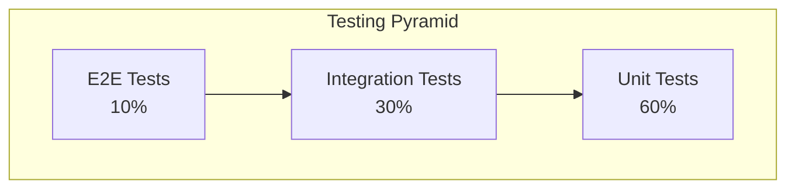

# Neural-Coding.com Testing Strategy

## Overview

This document defines the comprehensive testing strategy for neural-coding.com, including unit tests, integration tests, end-to-end tests, performance testing, and security validation.

---

## Testing Pyramid



| Level | Coverage | Tools | Run Frequency |
|-------|----------|-------|---------------|
| Unit | 60% | Vitest, pytest | Every commit |
| Integration | 30% | Miniflare, pytest | Every PR |
| E2E | 10% | Playwright | Daily, pre-release |

---

## Unit Testing Setup

### Worker Unit Tests (Vitest)

```typescript
// File: apps/api/vitest.config.ts

import { defineConfig } from 'vitest/config';

export default defineConfig({
  test: {
    environment: 'miniflare',
    environmentOptions: {
      modules: true,
      d1Databases: ['DB'],
      r2Buckets: ['ASSETS']
    },
    coverage: {
      provider: 'v8',
      reporter: ['text', 'html', 'lcov'],
      exclude: ['node_modules', 'dist', '**/*.d.ts']
    },
    include: ['src/**/*.test.ts'],
    globals: true
  }
});
```

```json
// File: apps/api/package.json (scripts)
{
  "scripts": {
    "test": "vitest run",
    "test:watch": "vitest",
    "test:coverage": "vitest run --coverage"
  }
}
```

### Sample Unit Tests

```typescript
// File: apps/api/src/lib/__tests__/time.test.ts

import { describe, it, expect } from 'vitest';
import { nowIso } from '../time';

describe('time utilities', () => {
  it('nowIso returns valid ISO string', () => {
    const result = nowIso();
    expect(result).toMatch(/^\d{4}-\d{2}-\d{2}T\d{2}:\d{2}:\d{2}/);
    expect(() => new Date(result)).not.toThrow();
  });
});
```

```typescript
// File: apps/api/src/lib/__tests__/ids.test.ts

import { describe, it, expect } from 'vitest';
import { newId } from '../ids';

describe('ID generation', () => {
  it('generates unique IDs with prefix', () => {
    const id1 = newId('job');
    const id2 = newId('job');

    expect(id1).toMatch(/^job_/);
    expect(id2).toMatch(/^job_/);
    expect(id1).not.toBe(id2);
  });

  it('generates IDs of consistent length', () => {
    const ids = Array.from({ length: 100 }, () => newId('test'));
    const lengths = new Set(ids.map(id => id.length));
    expect(lengths.size).toBe(1);
  });
});
```

```typescript
// File: apps/api/src/lib/__tests__/auth.test.ts

import { describe, it, expect, vi } from 'vitest';
import { Hono } from 'hono';
import { requireAdmin } from '../auth';

describe('requireAdmin', () => {
  it('returns 401 without Authorization header', () => {
    const app = new Hono();
    const c = {
      req: { header: () => undefined },
      json: vi.fn().mockReturnValue('error'),
      env: { ADMIN_TOKEN: 'secret' }
    };

    const result = requireAdmin(c as any);
    expect(result).toBe('error');
    expect(c.json).toHaveBeenCalledWith(
      { error: 'Missing Authorization header' },
      401
    );
  });

  it('returns 401 with invalid token', () => {
    const c = {
      req: { header: () => 'Bearer wrong_token' },
      json: vi.fn().mockReturnValue('error'),
      env: { ADMIN_TOKEN: 'secret' }
    };

    const result = requireAdmin(c as any);
    expect(result).toBe('error');
    expect(c.json).toHaveBeenCalledWith(
      { error: 'Invalid admin token' },
      401
    );
  });

  it('returns null with valid token', () => {
    const c = {
      req: { header: () => 'Bearer secret' },
      json: vi.fn(),
      env: { ADMIN_TOKEN: 'secret' }
    };

    const result = requireAdmin(c as any);
    expect(result).toBeNull();
  });
});
```

### Streamlit Unit Tests (pytest)

```python
# File: services/streamlit/lif-explorer/test_simulation.py

import numpy as np
import pytest

def simulate_lif(tau, dt, T, v_rest, v_reset, v_th, i_dc, noise_sigma):
    """LIF simulation function."""
    n = int(np.ceil(T / dt))
    t = np.arange(n) * dt
    v = np.zeros(n, dtype=np.float32)
    v[0] = v_rest
    spikes = np.zeros(n, dtype=np.int8)

    alpha = dt / tau
    for k in range(1, n):
        dv = alpha * (-(v[k - 1] - v_rest) + i_dc)
        if noise_sigma > 0:
            dv += noise_sigma * np.sqrt(dt) * np.random.randn()
        v[k] = v[k - 1] + dv
        if v[k] >= v_th:
            spikes[k] = 1
            v[k] = v_reset
    return t, v, spikes


class TestLIFSimulation:
    """Test cases for LIF neuron simulation."""

    def test_no_spikes_below_threshold(self):
        """No spikes when input current is below threshold."""
        t, v, spikes = simulate_lif(
            tau=20, dt=0.1, T=100,
            v_rest=0, v_reset=0, v_th=1,
            i_dc=0.5, noise_sigma=0
        )
        assert spikes.sum() == 0
        assert v.max() < 1.0

    def test_spikes_above_threshold(self):
        """Spikes occur when input exceeds threshold."""
        t, v, spikes = simulate_lif(
            tau=20, dt=0.1, T=100,
            v_rest=0, v_reset=0, v_th=1,
            i_dc=1.5, noise_sigma=0
        )
        assert spikes.sum() > 0

    def test_reset_after_spike(self):
        """Voltage resets to v_reset after spike."""
        t, v, spikes = simulate_lif(
            tau=20, dt=0.1, T=100,
            v_rest=0, v_reset=-0.5, v_th=1,
            i_dc=1.5, noise_sigma=0
        )
        spike_indices = np.where(spikes == 1)[0]
        for idx in spike_indices:
            assert v[idx] == pytest.approx(-0.5)

    def test_membrane_time_constant(self):
        """Larger tau means slower integration."""
        _, v_fast, _ = simulate_lif(
            tau=10, dt=0.1, T=50,
            v_rest=0, v_reset=0, v_th=10,
            i_dc=1.0, noise_sigma=0
        )
        _, v_slow, _ = simulate_lif(
            tau=50, dt=0.1, T=50,
            v_rest=0, v_reset=0, v_th=10,
            i_dc=1.0, noise_sigma=0
        )
        # Fast tau should reach higher voltage
        assert v_fast[-1] > v_slow[-1]

    def test_output_shapes(self):
        """Output arrays have correct shapes."""
        t, v, spikes = simulate_lif(
            tau=20, dt=0.1, T=100,
            v_rest=0, v_reset=0, v_th=1,
            i_dc=1.0, noise_sigma=0
        )
        expected_len = int(np.ceil(100 / 0.1))
        assert len(t) == expected_len
        assert len(v) == expected_len
        assert len(spikes) == expected_len

    def test_deterministic_without_noise(self):
        """Same results without noise."""
        args = dict(
            tau=20, dt=0.1, T=100,
            v_rest=0, v_reset=0, v_th=1,
            i_dc=1.2, noise_sigma=0
        )
        _, v1, s1 = simulate_lif(**args)
        _, v2, s2 = simulate_lif(**args)
        np.testing.assert_array_equal(v1, v2)
        np.testing.assert_array_equal(s1, s2)
```

---

## Integration Tests

### D1 Database Integration

```typescript
// File: apps/api/src/__tests__/db.integration.test.ts

import { describe, it, expect, beforeAll, afterAll } from 'vitest';
import { Miniflare } from 'miniflare';
import { getLearnArticles, getLearnArticleBySlug } from '../db';

describe('Database Integration', () => {
  let mf: Miniflare;
  let env: any;

  beforeAll(async () => {
    mf = new Miniflare({
      modules: true,
      script: '',
      d1Databases: ['DB']
    });
    env = await mf.getBindings();

    // Initialize schema
    await env.DB.exec(`
      CREATE TABLE learn_articles (
        slug TEXT PRIMARY KEY,
        title TEXT NOT NULL,
        one_liner TEXT NOT NULL,
        code_angle TEXT NOT NULL,
        bio_inspiration TEXT NOT NULL,
        content_md TEXT NOT NULL,
        cover_r2_key TEXT,
        tags_json TEXT NOT NULL DEFAULT '[]',
        status TEXT NOT NULL DEFAULT 'draft',
        created_at TEXT NOT NULL,
        updated_at TEXT NOT NULL
      )
    `);

    // Insert test data
    const ts = new Date().toISOString();
    await env.DB.prepare(`
      INSERT INTO learn_articles
      (slug, title, one_liner, code_angle, bio_inspiration, content_md, status, tags_json, created_at, updated_at)
      VALUES (?, ?, ?, ?, ?, ?, ?, ?, ?, ?)
    `).bind(
      'test-article',
      'Test Article',
      'One liner',
      'Code angle',
      'Bio inspiration',
      '# Content',
      'published',
      '["test"]',
      ts,
      ts
    ).run();
  });

  afterAll(async () => {
    await mf.dispose();
  });

  it('getLearnArticles returns published articles', async () => {
    const articles = await getLearnArticles(env);
    expect(articles).toHaveLength(1);
    expect(articles[0].slug).toBe('test-article');
  });

  it('getLearnArticleBySlug returns article', async () => {
    const article = await getLearnArticleBySlug(env, 'test-article');
    expect(article).not.toBeNull();
    expect(article?.title).toBe('Test Article');
  });

  it('getLearnArticleBySlug returns null for missing', async () => {
    const article = await getLearnArticleBySlug(env, 'nonexistent');
    expect(article).toBeNull();
  });
});
```

### API Integration Tests

```typescript
// File: apps/api/src/__tests__/api.integration.test.ts

import { describe, it, expect, beforeAll } from 'vitest';
import { Miniflare } from 'miniflare';
import app from '../index';

describe('API Integration', () => {
  let mf: Miniflare;

  beforeAll(async () => {
    mf = new Miniflare({
      modules: true,
      script: '',
      d1Databases: ['DB'],
      r2Buckets: ['ASSETS'],
      bindings: {
        ADMIN_TOKEN: 'test_admin_token'
      }
    });
  });

  it('GET /api/v1/health returns ok', async () => {
    const res = await app.request('/api/v1/health');
    expect(res.status).toBe(200);
    const data = await res.json();
    expect(data.ok).toBe(true);
  });

  it('GET /api/v1/playground/tools returns tools', async () => {
    const res = await app.request('/api/v1/playground/tools');
    expect(res.status).toBe(200);
    const data = await res.json();
    expect(data.tools).toBeInstanceOf(Array);
    expect(data.tools.length).toBeGreaterThan(0);
  });

  it('POST /api/v1/brain-context validates input', async () => {
    const res = await app.request('/api/v1/brain-context', {
      method: 'POST',
      headers: { 'Content-Type': 'application/json' },
      body: JSON.stringify({ term: '' })
    });
    expect(res.status).toBe(400);
  });

  it('POST /api/internal/ingest/tick requires auth', async () => {
    const res = await app.request('/api/internal/ingest/tick', {
      method: 'POST'
    });
    expect(res.status).toBe(401);
  });
});
```

---

## E2E Tests (Playwright)

### Setup

```typescript
// File: e2e/playwright.config.ts

import { defineConfig, devices } from '@playwright/test';

export default defineConfig({
  testDir: './tests',
  fullyParallel: true,
  forbidOnly: !!process.env.CI,
  retries: process.env.CI ? 2 : 0,
  workers: process.env.CI ? 1 : undefined,
  reporter: [
    ['html'],
    ['json', { outputFile: 'test-results/results.json' }]
  ],
  use: {
    baseURL: process.env.BASE_URL || 'https://neural-coding.com',
    trace: 'on-first-retry',
    screenshot: 'only-on-failure'
  },
  projects: [
    {
      name: 'chromium',
      use: { ...devices['Desktop Chrome'] }
    },
    {
      name: 'firefox',
      use: { ...devices['Desktop Firefox'] }
    },
    {
      name: 'webkit',
      use: { ...devices['Desktop Safari'] }
    },
    {
      name: 'mobile',
      use: { ...devices['iPhone 13'] }
    }
  ]
});
```

### E2E Test Cases

```typescript
// File: e2e/tests/homepage.spec.ts

import { test, expect } from '@playwright/test';

test.describe('Homepage', () => {
  test('loads successfully', async ({ page }) => {
    await page.goto('/');
    await expect(page).toHaveTitle(/Neural-Coding/);
  });

  test('displays tool cards', async ({ page }) => {
    await page.goto('/');
    const toolCards = page.locator('[data-testid="tool-card"]');
    await expect(toolCards).toHaveCount(4);
  });

  test('navigates to playground', async ({ page }) => {
    await page.goto('/');
    await page.click('text=Playground');
    await expect(page).toHaveURL(/\/playground/);
  });

  test('is responsive on mobile', async ({ page }) => {
    await page.setViewportSize({ width: 375, height: 667 });
    await page.goto('/');
    await expect(page.locator('header')).toBeVisible();
    await expect(page.locator('main')).toBeVisible();
  });
});
```

```typescript
// File: e2e/tests/learn.spec.ts

import { test, expect } from '@playwright/test';

test.describe('Learn Section', () => {
  test('displays article list', async ({ page }) => {
    await page.goto('/learn');
    await expect(page.locator('h1')).toContainText('Learn');
  });

  test('article page loads', async ({ page }) => {
    await page.goto('/learn');

    // Click first article if exists
    const firstArticle = page.locator('article a').first();
    if (await firstArticle.isVisible()) {
      await firstArticle.click();
      await expect(page.locator('article')).toBeVisible();
    }
  });

  test('handles 404 gracefully', async ({ page }) => {
    const response = await page.goto('/learn/nonexistent-article-slug');
    expect(response?.status()).toBe(404);
  });
});
```

```typescript
// File: e2e/tests/tools.spec.ts

import { test, expect } from '@playwright/test';

test.describe('LIF Explorer Tool', () => {
  test.beforeEach(async ({ page }) => {
    await page.goto('https://tools.neural-coding.com/lif/');
  });

  test('loads Streamlit app', async ({ page }) => {
    await expect(page.locator('text=LIF-Explorer')).toBeVisible({ timeout: 30000 });
  });

  test('has parameter sliders', async ({ page }) => {
    await expect(page.locator('text=tau')).toBeVisible({ timeout: 30000 });
    await expect(page.locator('text=V_th')).toBeVisible();
  });

  test('run simulation button works', async ({ page }) => {
    const runButton = page.locator('button:has-text("Run simulation")');
    await expect(runButton).toBeVisible({ timeout: 30000 });
    await runButton.click();

    // Wait for results
    await expect(page.locator('text=Spike count')).toBeVisible({ timeout: 10000 });
  });
});
```

```typescript
// File: e2e/tests/api.spec.ts

import { test, expect } from '@playwright/test';

test.describe('API Endpoints', () => {
  test('health check returns 200', async ({ request }) => {
    const response = await request.get('/api/v1/health');
    expect(response.ok()).toBeTruthy();
    const data = await response.json();
    expect(data.ok).toBe(true);
  });

  test('tools endpoint returns data', async ({ request }) => {
    const response = await request.get('/api/v1/playground/tools');
    expect(response.ok()).toBeTruthy();
    const data = await response.json();
    expect(data.tools).toBeInstanceOf(Array);
  });

  test('brain-context validates input', async ({ request }) => {
    const response = await request.post('/api/v1/brain-context', {
      data: { term: '' }
    });
    expect(response.status()).toBe(400);
  });

  test('internal endpoints require auth', async ({ request }) => {
    const response = await request.post('/api/internal/ingest/tick');
    expect(response.status()).toBe(401);
  });
});
```

---

## Performance Testing

### Lighthouse CI

```yaml
# File: .github/workflows/lighthouse.yml

name: Lighthouse CI

on:
  push:
    branches: [main]
  pull_request:
    branches: [main]

jobs:
  lighthouse:
    runs-on: ubuntu-latest
    steps:
      - uses: actions/checkout@v4

      - name: Run Lighthouse
        uses: treosh/lighthouse-ci-action@v11
        with:
          urls: |
            https://neural-coding.com
            https://neural-coding.com/playground
            https://neural-coding.com/learn
          budgetPath: ./lighthouse-budget.json
          uploadArtifacts: true
```

```json
// File: lighthouse-budget.json

[
  {
    "path": "/*",
    "timings": [
      { "metric": "first-contentful-paint", "budget": 2000 },
      { "metric": "largest-contentful-paint", "budget": 3000 },
      { "metric": "interactive", "budget": 4000 },
      { "metric": "total-blocking-time", "budget": 300 },
      { "metric": "cumulative-layout-shift", "budget": 0.1 }
    ],
    "resourceSizes": [
      { "resourceType": "script", "budget": 300 },
      { "resourceType": "total", "budget": 1000 }
    ]
  }
]
```

### Load Testing (k6)

```javascript
// File: e2e/load/api-load.js

import http from 'k6/http';
import { check, sleep } from 'k6';

export const options = {
  stages: [
    { duration: '30s', target: 10 },   // Ramp up
    { duration: '1m', target: 50 },    // Stay at 50
    { duration: '30s', target: 100 },  // Peak
    { duration: '30s', target: 0 }     // Ramp down
  ],
  thresholds: {
    http_req_duration: ['p(95)<500'],  // 95% under 500ms
    http_req_failed: ['rate<0.01']     // <1% errors
  }
};

const BASE_URL = __ENV.BASE_URL || 'https://neural-coding.com';

export default function () {
  // Health check
  const healthRes = http.get(`${BASE_URL}/api/v1/health`);
  check(healthRes, {
    'health status 200': (r) => r.status === 200,
    'health response time < 200ms': (r) => r.timings.duration < 200
  });

  // Tools endpoint
  const toolsRes = http.get(`${BASE_URL}/api/v1/playground/tools`);
  check(toolsRes, {
    'tools status 200': (r) => r.status === 200,
    'tools has data': (r) => JSON.parse(r.body).tools.length > 0
  });

  // Articles endpoint
  const articlesRes = http.get(`${BASE_URL}/api/v1/learn/posts`);
  check(articlesRes, {
    'articles status 200': (r) => r.status === 200
  });

  sleep(1);
}
```

---

## Security Checklist

### Pre-Deployment Security Audit

```markdown
## Authentication & Authorization

- [ ] Admin endpoints require valid ADMIN_TOKEN
- [ ] Tokens are stored as Wrangler secrets (not in code)
- [ ] No hardcoded credentials in repository
- [ ] API keys rotated regularly

## Input Validation

- [ ] All user inputs validated with Zod schemas
- [ ] SQL queries use prepared statements (parameterized)
- [ ] File uploads validated (type, size)
- [ ] Rate limiting implemented on public endpoints

## Headers & Transport

- [ ] HTTPS enforced (HSTS enabled)
- [ ] Security headers configured (CSP, X-Frame-Options, etc.)
- [ ] CORS properly configured
- [ ] Cookies use Secure and HttpOnly flags

## Data Protection

- [ ] Sensitive data not logged
- [ ] PII minimized in database
- [ ] Backups encrypted
- [ ] Data retention policies enforced

## Infrastructure

- [ ] VPS firewall configured (UFW)
- [ ] SSH key-only authentication
- [ ] Docker containers run as non-root
- [ ] Dependencies regularly updated

## Monitoring

- [ ] Error logging enabled
- [ ] Anomaly detection configured
- [ ] Incident response plan documented
```

### Security Test Cases

```typescript
// File: e2e/tests/security.spec.ts

import { test, expect } from '@playwright/test';

test.describe('Security', () => {
  test('has security headers', async ({ request }) => {
    const response = await request.get('/');
    const headers = response.headers();

    expect(headers['x-content-type-options']).toBe('nosniff');
    expect(headers['x-frame-options']).toBe('DENY');
    expect(headers['referrer-policy']).toBeTruthy();
  });

  test('admin endpoints reject without auth', async ({ request }) => {
    const endpoints = [
      '/api/internal/ingest/tick',
      '/api/internal/demo/publish',
      '/api/internal/demo/cover'
    ];

    for (const endpoint of endpoints) {
      const response = await request.post(endpoint);
      expect(response.status()).toBe(401);
    }
  });

  test('SQL injection prevented', async ({ request }) => {
    const response = await request.get(
      "/api/v1/learn/posts/'; DROP TABLE learn_articles; --"
    );
    // Should return 404, not error
    expect(response.status()).toBe(404);
  });

  test('XSS in term input sanitized', async ({ request }) => {
    const response = await request.post('/api/v1/brain-context', {
      data: { term: '<script>alert("xss")</script>' }
    });
    // Should handle gracefully
    expect([200, 400, 503]).toContain(response.status());
  });
});
```

---

## Test Data Management

### Fixtures

```typescript
// File: e2e/fixtures/articles.ts

export const testArticles = [
  {
    slug: 'test-lif-tutorial',
    title: 'Test LIF Tutorial',
    one_liner: 'A test article about LIF neurons',
    code_angle: 'Implementation details',
    bio_inspiration: 'Biological background',
    content_md: '# Test Content\n\nThis is test content.',
    tags: ['test', 'lif'],
    status: 'published'
  },
  {
    slug: 'test-draft-article',
    title: 'Draft Article',
    one_liner: 'This should not be visible',
    code_angle: 'Draft',
    bio_inspiration: 'Draft',
    content_md: '# Draft',
    tags: ['draft'],
    status: 'draft'
  }
];
```

### Database Seeding

```typescript
// File: scripts/seed-test-db.ts

import { testArticles } from '../e2e/fixtures/articles';

async function seedDatabase(db: D1Database) {
  const ts = new Date().toISOString();

  for (const article of testArticles) {
    await db.prepare(`
      INSERT OR REPLACE INTO learn_articles
      (slug, title, one_liner, code_angle, bio_inspiration, content_md, status, tags_json, created_at, updated_at)
      VALUES (?, ?, ?, ?, ?, ?, ?, ?, ?, ?)
    `).bind(
      article.slug,
      article.title,
      article.one_liner,
      article.code_angle,
      article.bio_inspiration,
      article.content_md,
      article.status,
      JSON.stringify(article.tags),
      ts,
      ts
    ).run();
  }

  console.log(`Seeded ${testArticles.length} articles`);
}
```

### Cleanup

```typescript
// File: scripts/cleanup-test-data.ts

async function cleanupTestData(db: D1Database) {
  // Delete test articles
  await db.prepare(`
    DELETE FROM learn_articles WHERE slug LIKE 'test-%'
  `).run();

  // Delete test jobs
  await db.prepare(`
    DELETE FROM jobs WHERE input_json LIKE '%test%'
  `).run();

  console.log('Test data cleaned up');
}
```

---

## CI/CD Integration

### Test Workflow

```yaml
# File: .github/workflows/test.yml

name: Test

on:
  push:
    branches: [main]
  pull_request:
    branches: [main]

jobs:
  unit-tests:
    runs-on: ubuntu-latest
    steps:
      - uses: actions/checkout@v4

      - uses: pnpm/action-setup@v4
        with:
          version: '10.27.0'

      - uses: actions/setup-node@v4
        with:
          node-version: '20'
          cache: 'pnpm'

      - run: pnpm install --frozen-lockfile
      - run: pnpm test
      - run: pnpm test:coverage

      - uses: codecov/codecov-action@v4
        with:
          files: ./coverage/lcov.info

  python-tests:
    runs-on: ubuntu-latest
    steps:
      - uses: actions/checkout@v4

      - uses: actions/setup-python@v5
        with:
          python-version: '3.12'

      - name: Install dependencies
        run: |
          cd services/streamlit/lif-explorer
          pip install -r requirements.txt
          pip install pytest pytest-cov

      - name: Run tests
        run: |
          cd services/streamlit/lif-explorer
          pytest --cov=. --cov-report=xml

  e2e-tests:
    runs-on: ubuntu-latest
    needs: [unit-tests]
    steps:
      - uses: actions/checkout@v4

      - uses: pnpm/action-setup@v4
        with:
          version: '10.27.0'

      - uses: actions/setup-node@v4
        with:
          node-version: '20'
          cache: 'pnpm'

      - run: pnpm install --frozen-lockfile

      - name: Install Playwright
        run: npx playwright install --with-deps

      - name: Run E2E tests
        run: npx playwright test
        env:
          BASE_URL: https://staging.neural-coding.com

      - uses: actions/upload-artifact@v4
        if: failure()
        with:
          name: playwright-report
          path: playwright-report/
```

---

## Coverage Requirements

| Module | Minimum Coverage | Current |
|--------|------------------|---------|
| apps/api/src/lib | 80% | - |
| apps/api/src/db | 70% | - |
| apps/api/src/agents | 60% | - |
| services/streamlit | 70% | - |

### Coverage Report

```bash
# Generate coverage report
pnpm test:coverage

# View HTML report
open coverage/index.html
```
