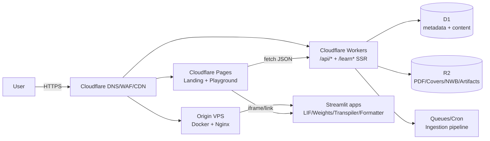
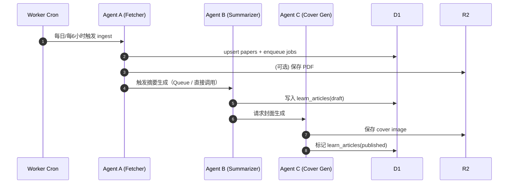

# Neural-coding.com 架构落地（Cloudflare + Streamlit）

## 目标

- 面向开发者的神经科学/神经形态计算平台：工具 + 文章 + API。
- 核心在 Cloudflare（低延迟、可扩展、运维成本低）。
- 工具侧（交互/可视化）用 Streamlit 快速迭代，Docker 化并由 Nginx 聚合。

## 逻辑组件（C4 / System）

## 域名与路由建议

> 关键点：同一个主域 `neural-coding.com` 可以由 Pages + Worker 分段承载（按 path route）。

- `neural-coding.com/` → Pages（静态站点）
- `neural-coding.com/playground/*` → Pages（工具入口页；嵌入/跳转）
- `neural-coding.com/api/` → Pages（API 文档）
- `neural-coding.com/api/v1/*` → Worker（对外 API）
- `neural-coding.com/api/internal/*` → Worker（内部写接口：ingest/publish）
- `neural-coding.com/learn*` → Worker（SSR 渲染文章列表/详情，SEO 友好）
- `neural-coding.com/assets/*` → Worker（R2 资源直出：封面/导出等）
- `tools.neural-coding.com/*` → VPS Origin（Nginx → Streamlit）

如果必须“同域同 path 嵌入工具”（例如 `neural-coding.com/playground/lif`），建议：

- Cloudflare 配置一条 Worker route 作为反代/重写到 `tools.*`（可控缓存 + 安全头）。

## 数据层（D1 + R2）

### D1（结构化 & 可查询）

- `papers`：论文元数据（arXiv/OpenReview）
- `learn_articles`：文章库（summary + code angle + bio inspiration + md）
- `term_explanations`：Brain-Context 术语解释缓存（减少成本）
- `jobs`：自动化流水线（A/B/C 各阶段状态）

### R2（大对象）

- 原始 PDF
- 封面图（DALL·E 或后续自研渲染）
- 数据产物（NWB、工具导出等）

Worker 对外提供 `GET /assets/<r2_key>` 作为静态资源出口（可配强缓存 + ETag）。
- 公开访问：Worker 提供 `/assets/*` 直出（带 `Cache-Control: immutable`），用于 Learn 封面等静态资源

## 自动化内容流水线（Agents）

## 安全与治理（必须有）

- Worker API：对写接口（ingest、publish）加 `ADMIN_TOKEN` + IP allowlist（可选）。
- Rate limit：对 public `/api/v1/brain-context` 做 per-IP 限制 + D1 cache。
- 内容审计：对生成内容加“来源链接 + 自动生成标记”，避免虚假引用。

## 性能策略（可直接落地）

- `/learn/:slug`：SSR + `ETag` + `stale-while-revalidate`
- 图片：R2 + Cloudflare Images（可选）+ responsive srcset
- API：GET 请求尽量 cache（Cache API + KV 作为二级缓存可选）
