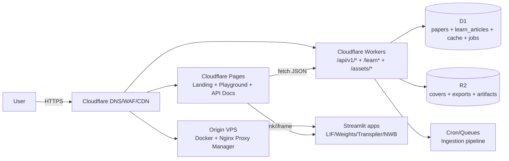
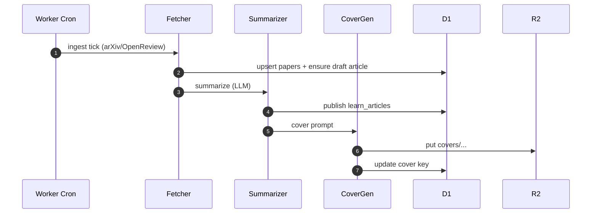

# Neural-coding.com 完整落地方案（可直接照做）

> 本仓库已经包含 MVP 级别的实现（Cloudflare Workers + D1/R2 + Astro + Docker/Streamlit）。本文把“从 0 到上线”的关键决策、配置点、风险点和扩展路线收敛成一份可执行方案。

## 0) 目标与非目标

- 目标
  - 一个面向开发者的“神经编码/计算神经科学”站点：**工具（Playground）+ 内容（Learn）+ API（可复现）**。
  - 核心上云：**Cloudflare Pages/Workers/D1/R2** 承载主站与内容分发；计算型交互工具用 **VPS + Docker/Streamlit** 快速迭代。
  - 自动化内容生产：每日/每 6 小时抓取 arXiv/OpenReview → 结构化总结 → 封面图 → 发布到 `/learn`（SEO 友好）。
- 非目标（MVP 阶段）
  - 不做复杂用户系统/支付（先用公开内容 + API Key 限流）。
  - 不上 K8s（VPS + Docker Compose 足够）。

## 1) 核心架构（C4 / System）



### 为什么这样拆

- **Pages**：极低维护成本的静态站，适合 Landing/Playground/文档。
- **Workers**：承担“可复现 API”、SEO 关键路径（`/learn` SSR）、以及对 D1/R2 的统一访问面。
- **VPS + Docker/Streamlit**：把“重计算/快速迭代 UI”与主站隔离（避免拖慢主站、避免边缘运行时间限制）。

## 2) 站点结构（Sitemap / Routes）

- `neural-coding.com/` → Pages（Landing）
- `neural-coding.com/playground/` → Pages（工具入口）
- `neural-coding.com/api/` → Pages（API 文档页）
- `neural-coding.com/api/v1/*` → Worker（公开 API）
- `neural-coding.com/api/internal/*` → Worker（内部写接口：ingest/publish，需要 `ADMIN_TOKEN`）
- `neural-coding.com/learn*` → Worker（SSR 渲染文章列表/详情）
- `neural-coding.com/assets/*` → Worker（从 R2 直出封面/产物，强缓存）
- `tools.neural-coding.com/*` → VPS（NPM → `infra/nginx/nginx.conf` 聚合后的工具路径）

> 提示：`/assets/*` 需要把 route 也挂到 Worker（见 `docs/runbooks.md`）。

## 3) 数据层（D1 + R2）

### D1（结构化/可查询）

Schema 在 `db/schema.sql`，关键表：

- `papers`：来源论文（`source`=`arxiv|openreview`，`(source, source_id)` 唯一幂等）
- `learn_articles`：文章（`one_liner / code_angle / bio_inspiration / content_md`）
- `term_explanations`：术语解释缓存（Brain-Context）
- `jobs`：流水线任务状态（便于可观测与重试）

### R2（大对象/静态产物）

- `covers/...`：封面图（由图片模型生成）
- `exports/...`：工具导出（未来：NWB/图表/参数快照）
- 通过 Worker 的 `/assets/*` 统一直出（`Cache-Control: immutable`）。

## 4) 工具矩阵（Playground）

推荐做法：**VPS 上只跑工具**，主站只负责导航与文档。

- LIF-Explorer：`https://tools.neural-coding.com/lif/`
- Synaptic-Weight Visualizer：`https://tools.neural-coding.com/weights/`
- Neural-Code-Transpiler：`https://tools.neural-coding.com/transpiler/`
- Neuro-Data-Formatter：`https://tools.neural-coding.com/nwb/`

对应的 Docker/Nginx 聚合在 `infra/docker-compose.yml` 与 `infra/nginx/nginx.conf`。

## 5) 自动化内容生产线（Agents A/B/C）

### 5.1 触发与执行模型

- 生产：Worker Cron（默认每 6 小时，见 `apps/api/wrangler.toml`）
- MVP：Cron 同步执行 A/B/C（数量限制，保证尾延迟可控）
- 规模化：Cron → Queue（投递任务）→ Consumer（带重试/死信）



### 5.2 数据源

- arXiv：默认 `q-bio.NC` + `cs.NE`（可用 `ARXIV_QUERY` 覆盖）
- OpenReview：需要按会议/venue 配置 invitation（用 `OPENREVIEW_INVITATIONS` 启用）

### 5.3 输出契约（Agent B）

仓库实现要求 LLM 输出 **严格 JSON**，结构为：

```json
{
  "one_liner": "一句话总结",
  "code_angle": "程序员如何复现/工程落点",
  "bio_inspiration": "生物学启发点",
  "content_md": "# 正文（Markdown）",
  "tags": ["snn", "lif", "hebbian"]
}
```

## 6) 部署步骤（按优先级）

### 6.1 Cloudflare Worker（API/Learn/Assets）

见 `docs/runbooks.md`，核心动作：

- 创建 D1 + R2
- `wrangler secret put OPENAI_API_KEY`、`wrangler secret put ADMIN_TOKEN`
- `wrangler d1 execute ... --file db/schema.sql`
- 部署 Worker
- 配置 routes：`/api/v1/*`、`/api/internal/*`、`/learn*`、`/assets/*`

### 6.2 Cloudflare Pages（主站）

- 站点源：`apps/web`
- 输出：`apps/web/dist`

### 6.3 VPS（Streamlit + NPM）

- `docker compose up -d --build`（在 `infra/`）
- Nginx Proxy Manager：`http://SERVER_IP:81`
- 创建 Proxy Host：`tools.neural-coding.com` → `nginx:80`

> 生产建议：改掉 compose 里的默认 DB/NPM 密码，管理端口 `:81` 做网络隔离。

## 7) SEO（MVP 必做项）

- `/learn`：SSR + canonical + OpenGraph（仓库已在 Worker 渲染层补齐）
- `assets`：强缓存 + 可作为 `og:image`
- Week 4 再做：sitemap、RSS、结构化数据（可在 Pages 侧补齐）

## 8) 安全与治理（上线底线）

- 写接口统一在 `/api/internal/*`，强制 `ADMIN_TOKEN`
- 公开接口（如 `/api/v1/brain-context`）加：
  - D1 cache（已做）
  - Rate limit（建议后续用 Durable Objects / Turnstile / WAF rules 做 per-IP）
- 自动化内容必须标注来源链接，避免“看似引用但实际虚构”的风险

## 9) 4 周路线图（交付物）

- Week 1：Pages + Worker + D1/R2 + tools 子域上线（可用）
- Week 2：四个工具 alpha 完整可交互（参数/导出/最小文档）
- Week 3：Agents A/B/C 定时跑通（arXiv + 可选 OpenReview）
- Week 4：队列化/重试/SEO（sitemap/rss/结构化数据）+ 成本与体验优化

